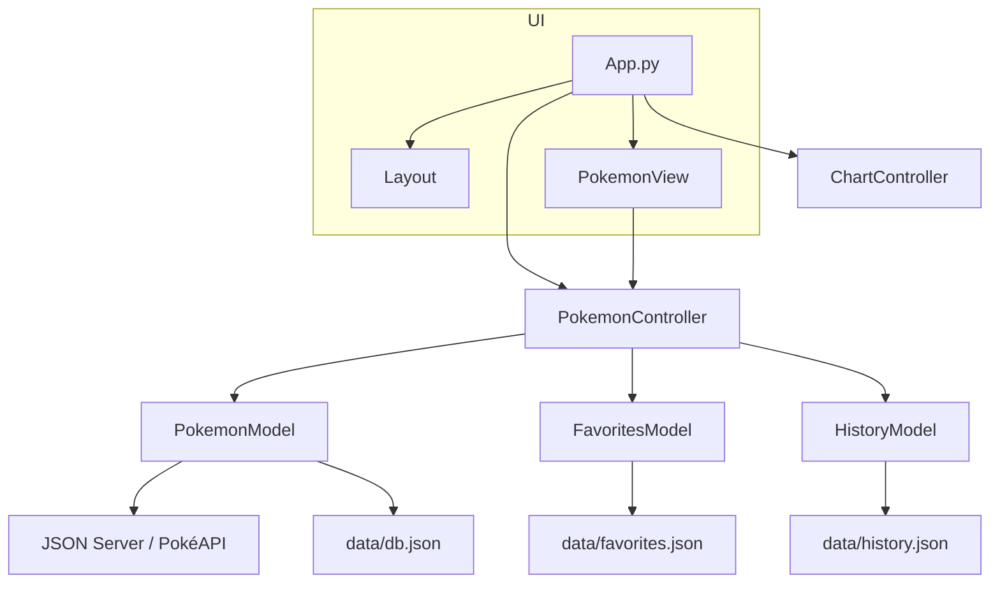
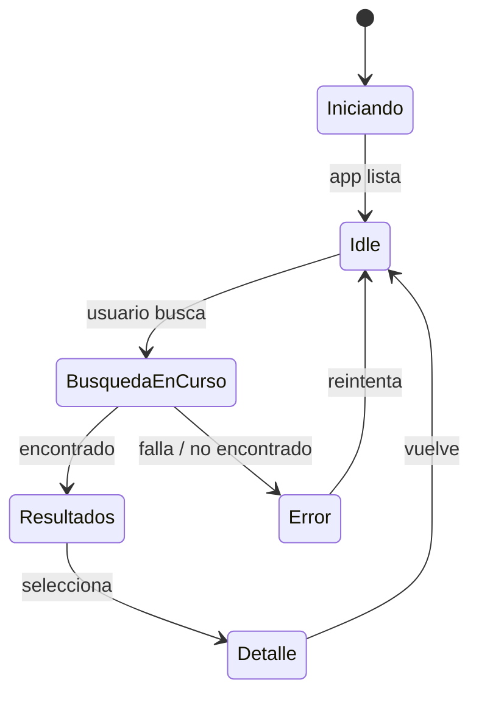
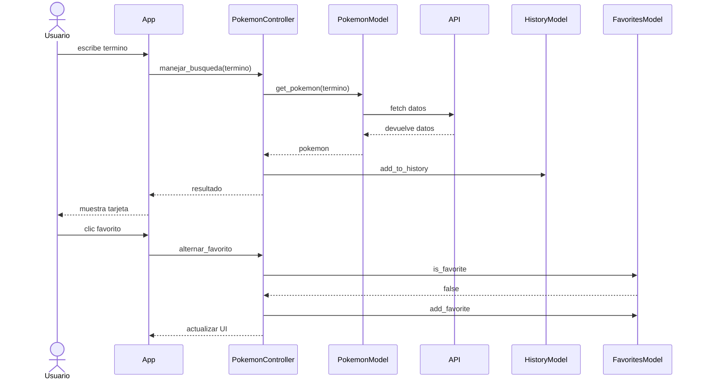

# Documentación UML Pokedex

Este documento describe la arquitectura y el flujo de la aplicación Pokedex y enumera los diagramas UML generados. Está diseñado para que comprendas el diseño, los componentes, los estados y las interacciones del sistema.

---

## 1. Estructura del proyecto

- `app.py` (entrada principal de Streamlit)
- `controllers/` (lógica de negocio de búsqueda, favoritos, historial y gráficos)
- `models/` (acceso a datos: JSON server/PokéAPI, favoritos, historial)
- `views/` (presentación UI con Streamlit)
- `utils/` (constantes y helpers)
- `data/` (JSON local con datos de Pokémon, favoritos e historial)
- `scripts/` (carga inicial, populate_db)
- `UML/` (diagramas en PlantUML)

---

## 2. Visión de alto nivel de la arquitectura

1. El usuario ingresa un término de búsqueda en la UI.
2. `app.py` delega a `PokemonController.manejar_busqueda()`.
3. `PokemonController` consulta `PokemonModel`, que busca en el servidor JSON local (`data/db.json`) o en la PokéAPI.
4. El resultado se muestra en `PokemonView`.
5. Favoritos se manipulan con `FavoritesModel`, historial con `HistoryModel`.
6. Gráficos con `ChartController`.

---

## 3. Diagrama de arquitectura (Mermaid)



---

## 4. Diagrama de estados (Mermaid)



---

## 5. Diagrama de secuencia (Mermaid)



---

## 6. Desarrollo paso a paso y fragmentos clave

### 6.1 `app.py`

- Inicializa estado con `st.session_state`
- Llama a los controladores y vistas

```python
# app.py (pseudocódigo)
import streamlit as st
from controllers.pokemon_controller import PokemonController
from views.pokemon_view import PokemonView

controller = PokemonController()
view = PokemonView()

# búsqueda
if st.button('Buscar'):
    termino = st.text_input('Nombre o ID')
    pokemon = controller.manejar_busqueda(termino)
    if pokemon:
        view.render_pokemon_card(pokemon)
```

### 6.2 `controllers/pokemon_controller.py`

- Validación de input
- Llamada a `PokemonModel`
- Manejo de favoritos e historial

```python
class PokemonController:
    def manejar_busqueda(self, termino):
        if not termino:
            raise ValueError('Ingrese nombre/ID')
        pokemon = PokemonModel().get_pokemon(termino)
        if pokemon:
            HistoryModel().add_to_history(termino, pokemon)
            return pokemon
        return None

    def alternar_favorito(self, pokemon):
        fav = FavoritesModel()
        if fav.is_favorite(pokemon['id']):
            fav.remove_favorite(pokemon['id'])
        else:
            fav.add_favorite(pokemon)
```

### 6.3 `models/pokemon_model.py`

- Búsqueda local en `data/db.json`
- Fallback a PokéAPI

```python
class PokemonModel:
    def get_pokemon(self, identifier):
        try:
            return self.get_pokemon_from_json_server(identifier)
        except Exception:
            return self.get_pokemon_from_pokeapi(identifier)
```

### 6.4 `models/favorites_model.py` y `models/history_model.py`

- Guardado/lectura en JSON local
- `favorites.json` y `history.json`

---

## 7. Generación y uso de diagramas PlantUML

En `UML/` hay carpetas con los .puml:

- `Clases/` - ya existente
- `Estados/` - diagramas de estado creados
- `Arquitectura/` - diagrama de arquitectura creada
- `Secuencia/` - diagrama de secuencia creada

Puedes renderizarlos con:

```bash
plantuml UML/Estados/pokedex_app_state_diagram.puml
plantuml UML/Arquitectura/pokedex_system_architecture.puml
plantuml UML/Secuencia/pokedex_sequence_diagram.puml
```

---

## 8. Recomendaciones

1. Revisar primero `README.md` y `UML/README.md`.
2. Ejecutar la app: `streamlit run app.py`.
3. Abrir los .puml en VS Code con la extensión PlantUML.
4. Simular casos de uso (Buscar, Favorito, Historial, Gráfico).
5. Añadir un caso de prueba con un nuevo Pokémon y observar en `data/history.json`.

---

## 9. Conclusión

La aplicación está diseñada como un ejercicio de arquitectura MVC ligera con una capa de presentación (Streamlit), controladores y modelos de persistencia. Este documento cubre el ciclo completo para que tus alumnos puedan entender tanto el diseño lógico como físico.
