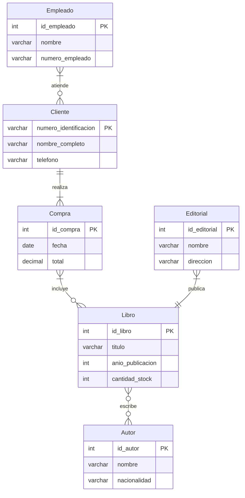

# Manual Completo para Modelado con el Modelo Entidad-Relación (ER)

---

## Índice

1. [Conceptos Fundamentales](#conceptos-fundamentales-del-modelo-entidad-relación)
   - 1.1 [Entidad](#entidad)
   - 1.2 [Atributo](#atributo)
   - 1.3 [Relación](#relación)
   - 1.4 [Cardinalidad](#cardinalidad)
   - 1.5 [Llaves (Primarias y Foráneas)](#llaves-primarias-y-foráneas)
   - 1.6 [Entidades Débiles y Fuertes](#entidades-débiles-y-fuertes)
2. [Ejemplo Detallado: Tienda de Libros](#ejemplo-detallado-tienda-de-libros)
   - 2.1 [Texto del Cliente (Requerimientos)](#texto-del-cliente-requerimientos)
   - 2.2 [Paso 1: Identificación de Entidades](#paso-1-identificación-de-entidades)
   - 2.3 [Paso 2: Extracción de Atributos](#paso-2-extracción-de-atributos)
   - 2.4 [Paso 3: Identificación de Relaciones y Cardinalidad](#paso-3-identificación-de-relaciones-y-cardinalidad)
   - 2.5 [Paso 4: Construcción del Diagrama ER](#paso-4-construcción-del-diagrama-er)
3. [Diagrama E-R](#diagrama-e-r)
4. [Ejercicios Prácticos de Modelado ER](#ejercicios-prácticos-de-modelado-er)
   - 4.1 [Ejercicio 1: Identificación de Entidades](#ejercicio-1-identificación-de-entidades)
   - 4.2 [Ejercicio 2: Atributos vs. Entidades](#ejercicio-2-atributos-vs-entidades)
   - 4.3 [Ejercicio 3: Relaciones y Cardinalidad](#ejercicio-3-relaciones-y-cardinalidad)
   - 4.4 [Ejercicio 4: Corrección de Errores](#ejercicio-4-corrección-de-errores)
   - 4.5 [Ejercicio 5: Diseño Simple](#ejercicio-5-diseño-simple)
5. [Evaluación Completa: Sistema de Clínica y Citas](#evaluación-completa-sistema-de-clínica-y-citas)
6. [Glosario](#glosario)

---

## Conceptos Fundamentales del Modelo Entidad-Relación

### Entidad

Una **entidad** es un objeto, concepto o cosa del mundo real o del dominio de la aplicación que tiene una existencia independiente y distinguible. Representa algo sobre lo que se quiere almacenar información y que puede diferenciarse claramente de otros objetos por sus características. En diagramas ER, la entidad se representa como un rectángulo y su nombre es un sustantivo singular.

**Cómo identificar entidades en un texto:**

- Es un objeto que participa activamente en el sistema.
- Tiene existencia propia, independiente de otras entidades.
- Se puede describir mediante atributos.
- Aparece varias veces o se espera que existan múltiples instancias.
- Está involucrada en relaciones con otras entidades.

**Ejemplos para una tienda de libros:**

- *Libro*, porque se vende en la tienda.
- *Cliente*, que realiza compras.
- *Editorial*, que publica libros.
- *Empleado*, que atiende o administra la tienda.

---

### Atributo

Un **atributo** es una propiedad o característica que describe una entidad o una relación. Expresa los detalles específicos que se quieren registrar sobre cada instancia de la entidad. En diagramas ER, el atributo se representa como un óvalo conectado a la entidad correspondiente.

**Cómo identificar atributos en un texto:**

- Describen características o datos específicos de una entidad.
- Responden a preguntas como: ¿cómo es?, ¿qué tiene?, ¿cuánto mide?, ¿cuándo ocurrió?
- No tienen existencia propia independiente.
- No deben confundirse con entidades.

**Ejemplos para la entidad *Libro* en la tienda:**

- *Título*, que indica el nombre del libro.
- *Año de publicación*, que muestra cuándo se publicó.
- *Cantidad en stock*, que indica cuántos hay disponibles.

> **Importancia:** Identificar correctamente atributos evita confundirlos con entidades o relaciones, asegurando un modelo coherente.

---

### Relación

Una **relación** es una asociación o vínculo lógico entre dos o más entidades que indica cómo interactúan o se conectan dentro del sistema. En diagramas ER, se representa con un rombo (diamante) y se nombra con un verbo o frase verbal que describe la interacción.

**Cómo identificar relaciones en un texto:**

- Se expresa una acción o vínculo entre entidades.
- Contiene verbos que conectan dos sustantivos (por ejemplo: "compra", "vende", "publica").
- Puede tener atributos propios (atributos de relación).
- Describe transacciones, eventos o asociaciones.

**Ejemplos en la tienda de libros:**

- *Compra* entre Cliente y Libro: indica que el cliente adquiere libros.
- *Publica* entre Editorial y Libro: la editorial publica libros.
- *Atiende* entre Empleado y Cliente: el empleado atiende al cliente.

> **Nota sobre atributos de relación:** Algunas relaciones pueden tener atributos propios. Por ejemplo, la relación *Compra* entre Cliente y Libro podría tener *fecha* o *total*. En esos casos, suele ser mejor modelar la relación como una entidad (débil) para poder almacenar dichos atributos.

---

### Cardinalidad

La **cardinalidad** indica el número mínimo y máximo de veces que una entidad puede participar en una relación. Es fundamental para expresar las restricciones reales del dominio y asegurar la integridad del modelo.

Se expresa en dos valores para cada lado de la relación:

- **Mínimo**: indica si la participación es obligatoria (1) u opcional (0).
- **Máximo**: indica la cantidad máxima de ocurrencias (1, N).

**Formas comunes de cardinalidad:**

- (0..1): Cero o una vez — participación opcional y única.
- (1..1): Exactamente una vez — participación obligatoria y única.
- (0..N): Cero o muchas veces — participación opcional y múltiple.
- (1..N): Una o muchas veces — participación obligatoria y múltiple.

**Tipos de relaciones según cardinalidad:**

| Tipo | Descripción | Ejemplo en la tienda de libros |
|------|-------------|-------------------------------|
| 1:1 | Una instancia de cada entidad se relaciona con una sola instancia de la otra. | Cada *Empleado* tiene un único *Horario*. |
| 1:N | Una instancia de la entidad A se asocia con muchas de la entidad B, pero B solo con una de A. | Un *Cliente* puede hacer muchas *Compras*, pero cada *Compra* pertenece a un solo *Cliente*. |
| N:M | Muchas instancias de A se relacionan con muchas de B. | Un *Libro* puede ser escrito por varios *Autores*, y un *Autor* puede escribir varios *Libros*. |

> **Importancia:** La cardinalidad define restricciones que reflejan la realidad, previene errores y facilita la implementación correcta.

---

### Llaves (Primarias y Foráneas)

Una **llave primaria** (*primary key*) es un atributo (o conjunto de atributos) que identifica de forma única a cada instancia dentro de una entidad. Por ejemplo, *número de identificación* es la llave primaria de *Cliente*, e *ISBN* podría ser la llave de *Libro*.

Una **llave foránea** (*foreign key*) es un atributo en una entidad que referencia la llave primaria de otra entidad, estableciendo así una relación entre ambas. Por ejemplo, si *Compra* tiene un atributo *id_cliente*, este es una llave foránea que apunta a *Cliente*.

**Reglas importantes:**

- Toda entidad debe tener una llave primaria que la identifique unívocamente.
- La llave primaria no puede contener valores nulos ni duplicados.
- Las llaves foráneas mantienen la **integridad referencial**: no puede existir un valor foráneo que no corresponda a una llave primaria existente.

---

### Entidades Débiles y Fuertes

Una **entidad fuerte** es aquella que tiene existencia independiente y puede identificarse por sus propios atributos (posee llave primaria propia). Una **entidad débil** depende de otra entidad (llamada *identificadora* o *padre*) para existir; no puede identificarse sin la entidad fuerte a la que pertenece.

**Características de una entidad débil:**

- Su llave primaria incluye, total o parcialmente, la llave primaria de la entidad fuerte de la que depende.
- Se representa con un rectángulo de doble línea en el diagrama ER.
- La relación que la conecta con su entidad identificadora se llama *relación identificadora* y se representa con un rombo de doble línea.

**Ejemplo:** Un *DetalleCompra* (que especifica qué libros incluye cada compra) sería una entidad débil, porque no tiene sentido sin la entidad *Compra*. Su llave primaria sería la combinación de *id_compra* + *id_libro*.

---

## Ejemplo Detallado: Tienda de Libros

### Texto del Cliente (Requerimientos)

"La tienda de libros 'Librería Nica' desea un sistema para gestionar sus operaciones. La tienda vende libros que tienen título, autor(es), editorial, año de publicación y cantidad en stock. Los clientes pueden registrarse proporcionando su nombre completo, número de identificación y teléfono. Cada cliente puede realizar múltiples compras, y cada compra puede incluir varios libros. La tienda tiene empleados que atienden a los clientes y registran las ventas. Cada libro puede ser publicado por una editorial diferente. El sistema debe reflejar todas estas relaciones para facilitar el control de ventas y el inventario."

---

### Paso 1: Identificación de Entidades

Analizando el texto, buscamos objetos o conceptos con existencia propia que el sistema debe manejar.

- **Libro**: Objeto principal de venta. Se identifica por título, autor(es), editorial, año y stock.
- **Cliente**: Personas que compran libros. Se registran con nombre, identificación y teléfono.
- **Compra**: Evento que relaciona clientes y libros. Almacena la transacción.
- **Empleado**: Persona que atiende clientes y registra ventas.
- **Editorial**: Empresa que publica libros.
- **Autor**: Persona que escribe libros. Aunque el texto lo menciona como atributo de *Libro*, al analizar el dominio vemos que tiene existencia propia (nombre, nacionalidad, etc.) y puede escribir varios libros, por lo que se modela como entidad independiente.

> **Justificación:** Cada uno es un elemento del mundo real con características y acciones propias, claramente diferenciables entre sí.

---

### Paso 2: Extracción de Atributos

Se analizan las descripciones para determinar qué propiedades son relevantes para cada entidad. Se sugiere una llave primaria para cada una.

- **Libro** (llave primaria: *id_libro*):
  - *Título*: nombre del libro.
  - *Año de publicación*: cuándo se publicó.
  - *Cantidad en stock*: unidades disponibles.

- **Cliente** (llave primaria: *numero_identificacion*):
  - *Nombre completo*: información básica del cliente.
  - *Número de identificación*: identificador único del cliente.
  - *Teléfono*: medio de contacto.

- **Compra** (llave primaria: *id_compra*):
  - *Fecha*: cuándo se realizó la compra.
  - *Total*: monto total de la compra.

- **Empleado** (llave primaria: *id_empleado*):
  - *Nombre*: nombre del empleado.
  - *Número de empleado*: identificador interno.

- **Editorial** (llave primaria: *id_editorial*):
  - *Nombre*: nombre de la editorial.
  - *Dirección*: ubicación de la editorial.

- **Autor** (llave primaria: *id_autor*):
  - *Nombre*: nombre del autor.
  - *Nacionalidad*: país de origen del autor.

> **Nota:** Los atributos de *Compra*, *Empleado*, *Editorial* y *Autor* se derivan del conocimiento del dominio, ya que el texto del cliente no los detalla. En un caso real, estos se confirmarían con el cliente.

---

### Paso 3: Identificación de Relaciones y Cardinalidad

Buscamos acciones o vínculos entre entidades, y definimos cuántas veces pueden ocurrir.

- **Cliente — Compra**
  - Relación: "realiza"
  - Cardinalidad: Un cliente puede hacer muchas compras (1..N). Cada compra pertenece a un solo cliente (1..1).
  - Interpretación: La tienda puede registrar varias compras por cliente.

- **Compra — Libro**
  - Relación: "incluye"
  - Cardinalidad: Cada compra puede incluir varios libros (1..N), y un libro puede estar en muchas compras (0..N).
  - Interpretación: Se maneja venta de múltiples libros por compra, y los libros se venden múltiples veces.

- **Empleado — Cliente**
  - Relación: "atiende"
  - Cardinalidad: Un empleado puede atender varios clientes (1..N), y un cliente puede ser atendido por varios empleados (0..N), por ejemplo en diferentes ocasiones.
  - Interpretación: Refleja la interacción del personal con clientes en distintas visitas.

- **Libro — Editorial**
  - Relación: "publica"
  - Cardinalidad: Una editorial publica muchos libros (1..N), y cada libro es publicado por una sola editorial (1..1).
  - Interpretación: Cada libro tiene una única editorial responsable.

- **Libro — Autor**
  - Relación: "escribe"
  - Cardinalidad: Un libro puede ser escrito por varios autores (0..N), y un autor puede escribir varios libros (0..N).
  - Interpretación: Es una relación N:M (muchos a muchos).

---

### Paso 4: Construcción del Diagrama ER

Para construir el diagrama ER paso a paso:

1. **Dibujar las entidades** como rectángulos. Colocar las entidades principales (*Libro*, *Cliente*) al centro y las relacionadas alrededor.
2. **Agregar los atributos** como óvalos conectados a cada entidad. Subrayar el nombre del atributo que funciona como llave primaria.
3. **Dibujar las relaciones** como rombos conectando las entidades involucradas. Etiquetar cada rombo con un verbo que describa la acción.
4. **Indicar las cardinalidades** junto a cada línea de conexión usando la notación (min..max), por ejemplo (1..N), (0..1).
5. **Identificar entidades débiles** si alguna depende de otra para existir y representarlas con rectángulo de doble línea.

En el diagrama resultante:

- Rectángulos para entidades: *Libro*, *Cliente*, *Compra*, *Empleado*, *Editorial*, *Autor*.
- Óvalos para atributos asociados a cada entidad.
- Rombos para relaciones: *realiza*, *incluye*, *atiende*, *publica*, *escribe*.
- Cardinalidades:
  - Cliente (1..1) — realiza — (1..N) Compra
  - Compra (1..N) — incluye — (0..N) Libro
  - Empleado (1..N) — atiende — (0..N) Cliente
  - Editorial (1..N) — publica — (1..1) Libro
  - Libro (0..N) — escribe — (0..N) Autor

---

## Diagrama E-R



> **Nota:** Este diagrama se renderiza automáticamente en GitHub, GitLab, VS Code y otros visores compatibles con Mermaid. No requiere extensiones adicionales.

**Notación de cardinalidad en el diagrama (crow's foot):**

| Lo que ves en el gráfico | Lado | Significado |
|---------------------------|------|-------------|
| `│``│` (dos barras verticales) | Ambos | Exactamente uno (1..1) |
| `│` `⫛` (barra + pata de gallo) | Derecho | Uno o muchos (1..N) |
| `⫛` `│` (pata de gallo + barra) | Izquierdo | Uno o muchos (1..N) |
| `⫛` `○` (pata de gallo + círculo) | Izquierdo | Cero o muchos (0..N) |
| `○` `⫛` (círculo + pata de gallo) | Derecho | Cero o muchos (0..N) |

### Cómo leer la cardinalidad en el diagrama

Los símbolos se leen en el siguiente orden:

```
[Entidad A]  ──  símbolo cerca de A  ──  [verbo]  ──  símbolo cerca de B  ──  [Entidad B]
```

1. **Para leer lo que le ocurre a la Entidad A:** párate en la Entidad B, mira hacia A y lee el símbolo que está pegado a A.
2. **Para leer lo que le ocurre a la Entidad B:** párate en la Entidad A, mira hacia B y lee el símbolo que está pegado a B.

**Ejemplo práctico con** `Cliente ||──|{ Compra : realiza`:

| Dirección de lectura | Frase resultante |
|----------------------|------------------|
| Desde *Compra* mirando a *Cliente* (`\|\|`) | "Cada **Compra** es realizada por **exactamente un Cliente**" |
| Desde *Cliente* mirando a *Compra* (`\|{`) | "Cada **Cliente** realiza **una o muchas Compras**" |

**Significado de los símbolos:**

| Símbolo visual | Se lee como | Significa que la entidad... |
|----------------|-------------|----------------------------|
| `│``│` (doble barra) | "exactamente una" | Participa una y solo una vez (obligatorio, único) |
| `⫛``│` (pata de gallo + barra) | "una o muchas" | Participa al menos una vez, sin límite superior |
| `○``│` (círculo + barra) | "cero o una" | Participa como máximo una vez, pero puede no participar |
| `⫛``○` (pata de gallo + círculo) | "cero o muchas" | Participa cero, una o varias veces (opcional y múltiple) |
| `○``⫛` (círculo + pata de gallo) | "cero o muchas" | Participa cero, una o varias veces (opcional y múltiple) |

**Regla mnemotécnica:** la **barra** (`│`) siempre marca el número **mínimo** (1 = obligatorio, 0 = opcional), y la **pata de gallo** (`⫛`) indica que puede haber **muchas** instancias.

**Frases para verbalizar cada relación del diagrama:**

| Relación | Se verbaliza como |
|----------|-------------------|
| Cliente `\|\|`—`\|{` Compra | "Cada **Cliente** puede realizar **una o muchas** Compras. Cada **Compra** pertenece a **exactamente un** Cliente." |
| Compra `}\|`—`o{` Libro | "Cada **Compra** incluye **uno o muchos** Libros. Cada **Libro** puede estar en **cero o muchas** Compras." |
| Empleado `}\|`—`o{` Cliente | "Cada **Empleado** atiende a **uno o muchos** Clientes. Cada **Cliente** puede ser atendido por **cero o muchos** Empleados." |
| Editorial `}\|`—`\|\|` Libro | "Cada **Editorial** publica **uno o muchos** Libros. Cada **Libro** es publicado por **exactamente una** Editorial." |
| Libro `}o`—`o{` Autor | "Cada **Libro** puede ser escrito por **cero o muchos** Autores. Cada **Autor** puede escribir **cero o muchos** Libros." |

---

## Ejercicios Prácticos de Modelado ER

**Objetivo:** Reforzar la identificación de entidades, atributos, relaciones y cardinalidad mediante ejercicios contextualizados.

---

### Ejercicio 1: Identificación de Entidades

**Contexto:** "Una universidad gestiona cursos impartidos por profesores. Cada curso tiene un código único, nombre y créditos. Los estudiantes se matriculan en cursos, y cada matrícula registra la calificación obtenida. Los profesores pertenecen a departamentos académicos."

**Preguntas:**

1. Lista todas las entidades del sistema.
2. Explica por qué cada elemento es una entidad según los criterios del manual.

---

### Ejercicio 2: Atributos vs. Entidades

**Contexto:** Para el sistema de la universidad:

- *Estudiante* debe almacenar: ID, nombre completo, fecha de nacimiento.
- *Matrícula* registra: semestre, calificación final.

**Preguntas:**

1. Identifica los atributos de cada entidad.
2. ¿Por qué "calificación final" es un atributo de *Matrícula* y no una entidad independiente?

---

### Ejercicio 3: Relaciones y Cardinalidad

**Contexto:**

- Un profesor imparte varios cursos, pero un curso solo es impartido por un profesor.
- Un estudiante puede matricularse en muchos cursos, y un curso tiene muchos estudiantes matriculados.

**Preguntas:**

1. Define las relaciones entre entidades (ej: Profesor-Curso).
2. Especifica la cardinalidad para cada relación usando notación (min..max).
3. Justifica la cardinalidad con base en las reglas del mundo real.

---

### Ejercicio 4: Corrección de Errores

**Diagrama propuesto:**

- Entidades: *Cliente*, *Pedido*, *Producto*.
- Relaciones:
  - *Cliente* realiza *Pedido* (cardinalidad: 1..1 en ambos lados).
  - *Pedido* incluye *Producto* (cardinalidad: 1..N en ambos lados).

**Preguntas:**

1. Detecta 2 errores en el modelo.
2. Propón correcciones explicando cómo violan las reglas del manual.

> **Pista:** Revisa si las cardinalidades reflejan correctamente el comportamiento real. ¿Un cliente puede hacer un solo pedido? ¿Un producto debe estar al menos en un pedido?

---

### Ejercicio 5: Diseño Simple

**Contexto:** "Una biblioteca presta libros a socios. Cada préstamo registra fecha de inicio y fin. Un socio puede tener múltiples préstamos activos, pero un libro solo puede estar prestado a un socio a la vez."

**Tarea:**

1. Define entidades, atributos y relaciones.
2. Especifica cardinalidades usando la tabla de tipos del manual (1:1, 1:N, N:M).

---

## Evaluación Completa: Sistema de Clínica y Citas

**Enunciado:**

"La clínica 'Salud Perfecta' desea implementar un sistema que gestione sus operaciones diarias. Cuando un paciente llega por primera vez, se registra en el sistema con su documento de identidad, su nombre completo, un número de contacto telefónico y su fecha de nacimiento. Con el tiempo, ese paciente puede solicitar múltiples citas médicas, y en cada una se registra la fecha y hora programadas, el motivo de la consulta y la sala donde será atendido.

Cada cita es atendida por un único médico, aunque un mismo médico puede atender varias citas a lo largo del día. Los médicos que trabajan en la clínica tienen un número de colegiado que los identifica, además de su nombre, la especialidad que practican —como cardiología o pediatría— y un teléfono de contacto.

Después de cada consulta, el médico redacta un informe detallado que incluye el diagnóstico y el tratamiento recomendado para el paciente. Este informe corresponde exclusivamente a esa cita y no puede existir sin ella."

**Tareas:**

1. **Identificación de entidades:** Lista todas las entidades relevantes, indicando cuáles son fuertes y cuáles son débiles.
2. **Atributos por entidad:** Para cada entidad, define sus atributos y señala la llave primaria sugerida.
3. **Relaciones y cardinalidad:**
   - Define relaciones usando verbos (ej: "atiende", "genera").
   - Especifica cardinalidad para cada extremo.
4. **Diagrama ER (desarrollo):** Dibuja el diagrama incluyendo:
   - Entidades (rectángulos).
   - Atributos (óvalos).
   - Relaciones (rombos con verbos).
   - Cardinalidades en las conexiones.

> **Nota:** *Informe Médico* es una entidad débil, ya que depende de *Cita* para existir. Su llave primaria debe incluir la llave de *Cita*.

---

## Glosario

| Término | Definición |
|---------|-----------|
| **Atributo** | Propiedad o característica que describe una entidad o relación. |
| **Cardinalidad** | Número mínimo y máximo de participaciones de una entidad en una relación. |
| **Entidad** | Objeto o concepto del mundo real con existencia independiente sobre el que se almacena información. |
| **Entidad débil** | Entidad que depende de otra (entidad fuerte) para existir y no tiene llave primaria propia completa. |
| **Entidad fuerte** | Entidad con existencia independiente y llave primaria propia. |
| **Integridad referencial** | Regla que asegura que los valores de una llave foránea correspondan a valores existentes en la llave primaria referenciada. |
| **Llave foránea** | Atributo en una entidad que referencia la llave primaria de otra entidad para establecer una relación. |
| **Llave primaria** | Atributo o conjunto de atributos que identifica de forma única cada instancia de una entidad. |
| **Normalización** | Proceso de organizar atributos para reducir redundancia y evitar anomalías en los datos. |
| **Relación** | Asociación lógica entre dos o más entidades. |
| **Relación identificadora** | Relación que conecta una entidad débil con su entidad fuerte. |
