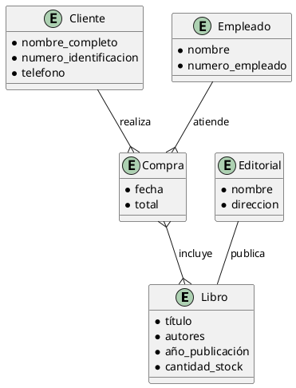

# Manual Completo para Modelado con el Modelo Entidad-Relación (ER)

---

## Conceptos Fundamentales del Modelo Entidad-Relación

### Entidad

Una **entidad** es un objeto, concepto o cosa del mundo real o del dominio de la aplicación que tiene una existencia independiente y distinguible. Representa algo sobre lo que se quiere almacenar información y que puede diferenciarse claramente de otros objetos por sus características. En diagramas ER, la entidad se representa como un rectángulo y su nombre es un sustantivo singular.

**Cómo identificar entidades en un texto:**

- Es un objeto que participa activamente en el sistema.
- Tiene existencia propia, independiente de otras entidades.
- Se puede describir mediante atributos.
- Aparece varias veces o se espera que existan múltiples instancias.
- Está involucrada en relaciones con otras entidades.

**Ejemplos para una tienda de libros:**

- *Libro*, porque se vende en la tienda.
- *Cliente*, que realiza compras.
- *Editorial*, que publica libros.
- *Empleado*, que atiende o administra la tienda.

---

### Atributo

Un **atributo** es una propiedad o característica que describe una entidad o una relación. Expresa los detalles específicos que se quieren registrar sobre cada instancia de la entidad. En diagramas ER, el atributo se representa como un óvalo conectado a la entidad correspondiente.

**Cómo identificar atributos en un texto:**

- Describen características o datos específicos de una entidad.
- Responden a preguntas como: ¿cómo es?, ¿qué tiene?, ¿cuánto mide?, ¿cuándo ocurrió?
- No tienen existencia propia independiente.
- No deben confundirse con entidades.

**Ejemplos para la entidad *Libro* en la tienda:**

- *Título*, que indica el nombre del libro.
- *Año de publicación*, que muestra cuándo se publicó.
- *Cantidad en stock*, que indica cuántos hay disponibles.

**Importancia:** Identificar correctamente atributos evita confundirlos con entidades o relaciones, asegurando un modelo coherente.

---

### Relación

Una **relación** es una asociación o vínculo lógico entre dos o más entidades que indica cómo interactúan o se conectan dentro del sistema. En diagramas ER, se representa con un rombo (diamante) y se nombra con un verbo o frase verbal que describe la interacción.

**Cómo identificar relaciones en un texto:**

- Se expresa una acción o vínculo entre entidades.
- Contiene verbos que conectan dos sustantivos (por ejemplo: "compra", "vende", "publica").
- Puede tener atributos propios (atributos de relación).
- Describe transacciones, eventos o asociaciones.

**Ejemplos en la tienda de libros:**

- *Compra* entre Cliente y Libro: indica que el cliente adquiere libros.
- *Publica* entre Editorial y Libro: la editorial publica libros.
- *Atiende* entre Empleado y Cliente: el empleado atiende al cliente.

---

### Cardinalidad

La **cardinalidad** indica el número mínimo y máximo de veces que una entidad puede participar en una relación. Es fundamental para expresar las restricciones reales del dominio y asegurar la integridad del modelo.

Se expresa en dos valores para cada lado de la relación:

- **Mínimo**: indica si la participación es obligatoria (1) o opcional (0).
- **Máximo**: indica la cantidad máxima de ocurrencias (1, N).

**Formas comunes de cardinalidad:**

- (0..1): Cero o una vez — participación opcional y única.
- (1..1): Exactamente una vez — participación obligatoria y única.
- (0..N): Cero o muchas veces — participación opcional y múltiple.
- (1..N): Una o muchas veces — participación obligatoria y múltiple.

**Tipos de relaciones según cardinalidad:**

| Tipo | Descripción | Ejemplo en la tienda de libros |
|-------|-------------|-------------------------------|
| 1:1   | Una instancia de cada entidad se relaciona con una sola instancia de la otra. | Cada *Empleado* tiene un único *Horario*. |
| 1:N   | Una instancia de la entidad A se asocia con muchas de la entidad B, pero B sólo con una de A. | Un *Cliente* puede hacer muchas *Compras*, pero cada *Compra* pertenece a un solo *Cliente*. |
| N:M   | Muchas instancias de A se relacionan con muchas de B. | Un *Libro* puede ser escrito por varios *Autores*, y un *Autor* puede escribir varios *Libros*. |

**Importancia:** La cardinalidad define restricciones que reflejan la realidad, previenen errores y facilitan la implementación correcta.

---

## Ejemplo Detallado: Tienda de Libros

### Texto del Cliente (Requerimientos)

"La tienda de libros ‘Librería Nica’ desea un sistema para gestionar sus operaciones. La tienda vende libros que tienen título, autor(es), editorial, año de publicación y cantidad en stock. Los clientes pueden registrarse proporcionando su nombre completo, número de identificación y teléfono. Cada cliente puede realizar múltiples compras, y cada compra puede incluir varios libros. La tienda tiene empleados que atienden a los clientes y registran las ventas. Cada libro puede ser publicado por una editorial diferente. El sistema debe reflejar todas estas relaciones para facilitar el control de ventas y el inventario."

---

### Paso 1: Identificación de Entidades

Analizando el texto, buscamos objetos o conceptos con existencia propia que el sistema debe manejar.

- **Libro**: Se menciona directamente, es el objeto principal vendido.
- **Cliente**: Personas que compran libros.
- **Compra**: Evento o acción que relaciona clientes y libros.
- **Empleado**: Persona que atiende y registra ventas.
- **Editorial**: Empresa que publica libros.

> **Justificación:**  
> Cada uno es un elemento del mundo real con características y acciones propias, claramente diferenciables entre sí.

---

### Paso 2: Extracción de Atributos

Se analizan las descripciones para determinar qué propiedades son relevantes para cada entidad.

- *Libro*:
  - **Título**: Se menciona explícitamente como identificación del libro.
  - **Autor(es)**: Aunque podría ser una entidad en sí, aquí se considera un atributo descriptivo (por simplicidad).
  - **Editorial**: Se trata como entidad aparte, pero se asocia al libro.
  - **Año de publicación**: Fecha de salida del libro.
  - **Cantidad en stock**: Cantidad física disponible.
  
- *Cliente*:
  - **Nombre completo**: Información básica y necesaria.
  - **Número de identificación**: Para distinguir clientes.
  - **Teléfono**: Medio de contacto.
  
- *Compra*:
  - Aunque se considera evento, podría tener atributos como fecha, monto, pero en este caso no se especifican en el texto.
  
- *Empleado*:
  - No se detallan atributos específicos, pero podrían ser nombre, número de empleado, etc.
  
- *Editorial*:
  - No se especifican atributos en el texto, pero podría incluir nombre, dirección.

> **Justificación:**  
> Los atributos se extraen de las características y datos que el cliente especificó como importantes para cada entidad.

---

### Paso 3: Identificación de Relaciones y Cardinalidad

Buscamos acciones o vínculos entre entidades, y definimos cuántas veces pueden ocurrir.

- **Cliente — Compra**  
  - Relación: "realiza"  
  - Cardinalidad: Un cliente puede hacer muchas compras (1..N). Cada compra pertenece a un solo cliente (1..1).  
  - Interpretación: La tienda puede registrar varias compras por cliente.

- **Compra — Libro**  
  - Relación: "incluye"  
  - Cardinalidad: Cada compra puede incluir varios libros (1..N), y un libro puede estar en muchas compras (0..N).  
  - Interpretación: Se maneja venta de múltiples libros por compra, y los libros se venden múltiples veces.

- **Empleado — Cliente**  
  - Relación: "atiende"  
  - Cardinalidad: Un empleado puede atender varios clientes (1..N), y un cliente puede ser atendido por varios empleados (0..N) (por ejemplo, en diferentes ocasiones).  
  - Interpretación: Refleja la interacción del personal con clientes.

- **Libro — Editorial**  
  - Relación: "publica"  
  - Cardinalidad: Una editorial publica muchos libros (1..N), y cada libro es publicado por una sola editorial (1..1).  
  - Interpretación: La relación es uno a muchos.

---

### Paso 4: Construcción del Diagrama ER

Representamos gráficamente las entidades, atributos, relaciones y cardinalidades:

- Rectángulos para entidades: *Libro*, *Cliente*, *Compra*, *Empleado*, *Editorial*.
- Óvalos para atributos asociados a cada entidad.
- Rombos para relaciones: *realiza*, *incluye*, *atiende*, *publica*.
- Líneas que conectan entidades y relaciones, con cardinalidad indicada junto a cada conexión, por ejemplo:
  - Cliente (1..1) — realiza — (1..N) Compra.
  - Compra (1..N) — incluye — (0..N) Libro.
  - Empleado (1..N) — atiende — (0..N) Cliente.
  - Editorial (1..N) — publica — (1..1) Libro.

---

## Diagrama E-R

---

## Autoevaluación

1. ¿Qué criterios utilizas para diferenciar una entidad de un atributo?  
2. En el ejemplo de la tienda de libros, ¿por qué "Compra" se considera una entidad y no un atributo?  
3. ¿Cómo se identifica una relación en un texto de requerimientos? Da un ejemplo distinto al del manual.  
4. Explica con tus palabras qué significa la cardinalidad (1..N) entre Cliente y Compra.  
5. ¿Qué podría pasar si no se define correctamente la cardinalidad en un modelo ER?

---
