# MANUAL PRÁCTICO DE PLANTUML

---

## INTRODUCCIÓN

---

**¿Qué es PlantUML?**
[PlantUML](https://plantuml.com/es/) es una herramienta muy versátil que facilita la creación rápida y directa de una amplia gama de diagramas.

Utilizando un lenguaje sencillo e intuitivo, los usuarios pueden redactar sin esfuerzo diversos tipos de diagramas. Para una exploración detallada de las capacidades del lenguaje y la sintaxis, [consulta la Guía de Referencia del Lenguaje PlantUML](https://plantuml.com/es/guide).

Al ser nuevos usando PlantUML, lo más recomendable es que comiences con su [página de inicio](https://plantuml.com/es/starting) para ponerte en marcha rápidamente. Si tienes alguna pregunta, su [página F.A.Q.](https://plantuml.com/es/faq) es un recurso valioso. Además, PlantUML se puede integrar perfectamente con una variedad de otras herramientas para mejorar su flujo de trabajo.

**¿Por qué este manual?**

| Característica  | Manual Tradicional    | Este Manual       |
| ---------------- | --------------------- | ----------------- |
| Enfoque          | Teórico              | 100% Práctico    |
| Requisitos       | Conocimiento UML      | Cero experiencia  |
| Resultados       | En capítulos finales | Desde el minuto 1 |
| Personalización | Limitada              | Skins y templates |

### Propósito del manual

**Objetivo principal**:
Convertirte en productor de diagramas técnicos en 4 horas, dominando:

```planuml
@startuml Objetivos

@enduml
```

### Instalación y visualización

1. **Online**La forma más sencilla de visualizar un diagrama en PlantUML es ejecutarlo desde el [servidor web oficial](https://www.plantuml.com/plantuml/uml/SyfFKj2rKt3CoKnELR1Io4ZDoSa700001).
2. **VS Code**
   Para instalar PlantUML y usarlo en Visual Studio Code (VSCode), sigue estos pasos:
   **Requisitos previos**
   Java Runtime Environment (JRE):

- PlantUML requiere Java para funcionar.
- Descárgalo de Oracle JDK o OpenJDK.

Verifica que esté instalado ejecutando en la terminal:

> java -version

**Instalación en VSCode**:

- Abre VSCode y ve a Extensiones (Ctrl+Shift+X).
- Busca e instala la extensión: "PlantUML" (por jebbs.plantuml).

**Configuración básica**
Habilitar la vista previa:

- Abre un archivo .puml o .plantuml.
- Presiona Alt + D (Windows/Linux) o Option + D (Mac) para abrir la vista previa.
- (Opcional) Configurar Graphviz (para diagramas complejos):
- [Descarga Graphviz](https://gitlab.com/api/v4/projects/4207231/packages/generic/graphviz-releases/12.2.1/windows_10_cmake_Release_graphviz-install-12.2.1-win64.exe). desde graphviz.org.
- Añade la ruta de dot (Graphviz) en la configuración de VSCode, igualmente en la instalación puedes marcar la opción de añadirlo al path / variables de entorno.

**Ejemplo de uso**:

- Crea un archivo diagrama.puml.
- Escribe un diagrama sencillo:

```planuml
@startuml
Alice -> Bob: Hola
Bob --> Alice: ¿Cómo estás?
@enduml
```

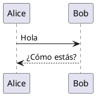

**Visualización**:

Para visualizar online se ebe presionar el botón `submint`, en cambio para visualizar desde vscode se debe presioar el shorcut `Alt+D`

---

## Diagrama de casos de uso

---

Un [**diagrama de casos de uso**](https://plantuml.com/es/use-case-diagram). es una representación visual utilizada en ingeniería de software para representar las interacciones entre **los actores** del sistema y el propio sistema. Captura el comportamiento dinámico de un sistema ilustrando sus casos de uso y los roles que interactúan con ellos. Estos diagramas son esenciales para especificar los **requisitos funcionales** del sistema y comprender cómo interactuarán los usuarios con él. Al proporcionar una visión de alto nivel, los diagramas de casos de uso ayudan a las partes interesadas a comprender la funcionalidad del sistema y su valor potencial.

**PlantUML** ofrece un enfoque único para crear diagramas de casos de uso a través de su lenguaje basado en texto. Una de las principales ventajas de utilizar PlantUML es su **sencillez y eficacia**. En lugar de dibujar manualmente formas y conexiones, los usuarios pueden definir sus diagramas utilizando descripciones textuales intuitivas y concisas. Esto no sólo acelera el proceso de creación de diagramas, sino que también garantiza su **coherencia y precisión**. La capacidad de integrarse con varias plataformas de documentación y su amplia gama de formatos de salida compatibles hacen de PlantUML una herramienta versátil tanto para desarrolladores como para no desarrolladores. Por último, al ser de **código abierto**, PlantUML cuenta con una [sólida comunidad](https://forum.plantuml.net). que contribuye continuamente a su mejora y ofrece una gran cantidad de recursos para usuarios de todos los niveles.

### Casos de uso

Los casos de uso se encierran entre paréntesis (porque dos paréntesis parecen un óvalo).

También puede utilizar la palabra clave `usecase` para definir un caso de uso . Y puede definir un alias, utilizando la palabra clave as. Este alias se utilizará más adelante, cuando se definan las relaciones.

```planuml
@startuml

(primer caso de uso)
(otro caso de uso) as (UC2)
usecase UC3
usecase (último\ncaso de uso) as UC4

@enduml
```

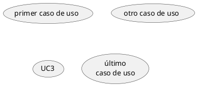

[Consultar visualización online](https://editor.plantuml.com/uml/SoWkIImgAStDuUBISCiiAYvHA2rEJKuiJjNaqd3Coo_9I2s2YoWa5YjeX3eRQN91HHH2dOtXR0sVnEAIc3nanQ7E9bnS3gbvAI3p0G00)

### Actores

Los actores se encierran entre dos puntos.
También puedes usar la palabra reservada `actor` para definir un actor. Además puedes definir un alias, usando la palabra reservada `as`. Este alias será usado más adelante, cuando definamos relaciones.
Veremos más adelante que las declaraciones de los actores son opcionales.

**Ejemplo en PlantUML**:

```planuml
@startuml

:Primer Actor:
:otro\nactor: as tipo2
actor tipo3
actor :último actor: as tipo4

@enduml
```

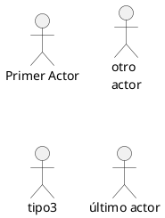

[Consultar visualización online](https://editor.plantuml.com/uml/SoWkIImgAStDuUAoSiiiAYvHS4mkoI-ouh9opCiloKWjYibB10ie91Oh-ARc6N61kI2cCPHfvPC8r8QYoeIBoo4rBmLaB000)

#### Cambiar el estilo del actor

Puedes cambiar el estilo del actor de hombre==== palo ==== (==== por defecto ====) a:
un hombre impresionante con el comando `skinparam actorStyle awesome`;
un hombre hueco con el comando `skinparam actorStyle hollow`.

**Hombre palo (por defecto)**:

```planuml
@startuml
:usuario: --> (Usa)
"administrador principal" as Administrador
"Usa la aplicación" as (Usa)
Administrador --> (administra la aplicación)
@enduml
```

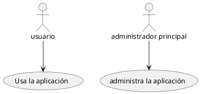

[Consultar visualización online](https://editor.plantuml.com/uml/SoWkIImgAStDuR8ABKujibBGrRLJq00oDRcKV1CpynGSKt8pyvGK4eiXB2ube9n2IKQgGc91GKvcSc99PZv46g89h0XY28I9fbIJoo4rBmLa7m00)

**Hombre impresionante**:

```planuml
@startuml
skinparam actorStyle awesome
:usuario: --> (Usa)
"administrador principal" as Administrador
"Usa la aplicación" as (Usa)
Administrador --> (administra la aplicación)
@enduml
```

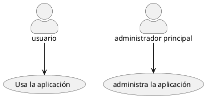

[Consultar visualización online](https://editor.plantuml.com/uml/SoWkIImgAStDuIhEpimhI2nAp5L8J2x9BmekgSn9LKWiJotEpqtbiWejJYsoKj3LjLFG038rkPHy4pFp51nJSZFpb1GIYo4iBYMWd4991b1VGK5EPd9YIMO-H1gY2Qm8OWY4YQPKayiXDIy5v1W0)

**Hombre hueco**:

```planuml
@startuml
skinparam actorStyle Hollow
:usuario: --> (Usa)
"administrador principal" as Administrador
"Usa la aplicación" as (Usa)
Administrador --> (administra la aplicación)
@enduml
```

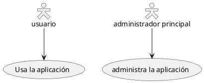

[Consultar visualización online](https://editor.plantuml.com/uml/SoWkIImgAStDuIhEpimhI2nAp5L8J2x9BmekgSn9LV38pyd9BrVWiWejJYsoKj3LjLFG038rkPHy4pFp51nJSZFpb1GIYo4iBYMWd499Hgf2Oa51JcPoOabcFaGQeWci2688X8ccL9FB8JKl1UGO0000)

### Descripción de Casos de uso

Si quiere realizar una descripción en varias líneas, puede usar citas (" ").

También puede usar los siguientes separadores: -- .. == __. Y puede introducir títulos dentro de los separadores.

```planuml
@staruml

usecase UC1 as "Puedes usar 
varias líneas para definir tu caso de uso.
También puedes usar separadores.
--
Se permiten varios tipos de separadores.
==
Y puedes agregar títulos:
..En Conclusion..
Esto permite descripciones largas.."

@enduml
```

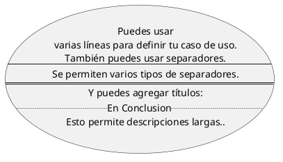

[Consultar visualización online](https://editor.plantuml.com/uml/HOz12W8n303lUKNmlWMlmiBAFa4zU8njr49ibgPL_BqjhdWB4sP89YkKItq8G3NsP8odUOjak3bhHKy96mVZ9sSIb9ZOi2W6lhOHtrephgA3dq5YsYaQBvIfQ3O7mm27jVB7I9bnKRDuaHOOHzYdqAlVJWXOOX6s7JWtQ_9IBMfo3exts6GHVHaAvHktYypdk9I-tm1Cd49_wmC0)

### Utilice el paquete

Puede utilizar paquetes para agrupar actores o casos de uso

```planuml
@startuml
left to right direction
actor Invitado as i
package Profesional {
  actor Chef as c
  actor "Crítico de Comida" as cc
}
package Restaurante {
  usecase "Come" as UC1
  usecase "Paga" as UC2
  usecase "Bebe" as UC3
  usecase "Evalua" as UC4
}
cc --> UC4
i --> UC1
i --> UC2
i --> UC3
@enduml
```

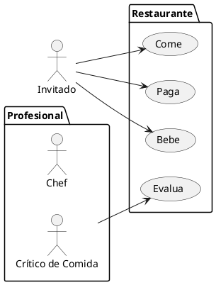

[Consultar visualización online](https://editor.plantuml.com/uml/JP3D2eCm48JlUOh5kmUrvoBOdwi8VO0bRcBG9YNPj9JITwzQ2TvczviPbgq3e-TudyH4Ye4TUAC7XjvuacoS5IZPURX62WmOG8i7oX4rGUkTeX1c3qxm4G1_PpEGMemoRRABSpqqth2HsOAK5DzKqyt563rQNajY88c183iZmn9S4xUcsBCMtw3cvXqlz_paZHqtKEr1Hqz3huqSvYkKX3m_heFUL95KcLGbQhBzygOV)

Puede utilizar rectangle para cambiar la visualización del paquete

```planuml
@startuml
left to right direction
actor "Critico de comida" as cc
rectangle Restaurante {
  usecase "Come" as UC1
  usecase "Paga" as UC2
  usecase "Bebe" as UC3
}
cc --> UC1
cc --> UC2
cc --> UC3
@enduml
```

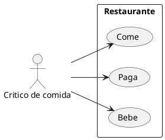

[Consultar visualización online](https://editor.plantuml.com/uml/JO-n2i9044Jx_OeXVGgJNW9HQn7yWELkBnx6EzZR52B-kqaGJJVmPXvCLupLfiT8emI3PMWSRWOVLPp5d8YTPKLrojcZrsZHLU22u6XfS1f6mKLcpQIS32y2fYAEYw0wic4PhejhlzkoCpyHPlE6Drj-q9ZkNz3Icu93NUzNooys_zXI9yalHpu0)

### Ejemplo básico

Para relacionar actores y casos de uso, la flecha `-->` es usada.
Cuanto más guiones `-` en la flecha, más larga será la misma. Puedes añadir una etiqueta en la flecha, añadiendo el carácter `:` en la definición de la flecha.
En este ejemplo, puedes ver que User no ha sido definido, y es usado como un actor.

```planuml
@startuml

Usuario -> (Inicia)
Usuario --> (Usa la aplicación) : Una pequeña descripción

:Administrador Principal: ---> (Usa la aplicación) : Esto es\nOtra\nDescripción

@enduml
```

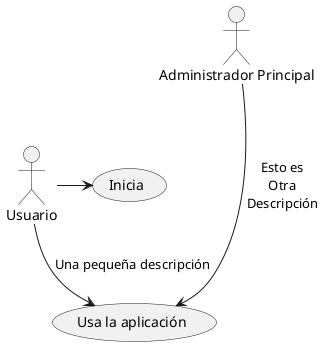

[Consultar visualización online](https://editor.plantuml.com/uml/JO-n2i9044Jx_OeXVGgJNW9HQn7yWELkBnx6EzZR52B-kqaGJJVmPXvCLupLfiT8emI3PMWSRWOVLPp5d8YTPKLrojcZrsZHLU22u6XfS1f6mKLcpQIS32y2fYAEYw0wic4PhejhlzkoCpyHPlE6Drj-q9ZkNz3Icu93NUzNooys_zXI9yalHpu0)

### Extensión

Si un actor/caso de uso extiende a otro, puede utilizar el símbolo `<|--`.

```planuml
@startuml
:Administrador Principal: as Administrador
(Usa la aplicación) as (Usa)

Usuario <|-- Administrador
(Inicia) <|-- (Usa)

@enduml
```

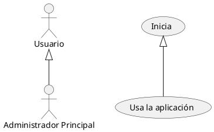

[Consultar visualización online](https://editor.plantuml.com/uml/SoWkIImgAStDuRBoJSpCKt1CoStCir98B8Qmk3H2YrCLIZ9I5H8B2d8oanDBClFpD47I80bDBYuWMQHWKwEh2rCV339F4o84LUEGcfS2iW40)

### Usando notas

Puedes usar las palabras claves: `note left of` , `note right of` , `note top of` , `note bottom of`, para añadir notas relacionadas a un objeto en particular.
También se puede añadir un nota solitaria con la palabra clave `note`, y después realacionarla con otro objeto usando el símbolo `..` .

```planuml
@startuml
:Administrador Principal: as Administrador
(Usa la aplicación) as (Usa)

Usuario -> (Inicia)
Usuario --> (Usa)

Administrador ---> (Usa)

note right of Admin : Esto es un ejemplo.

note right of (Usa)
  Una nota nota también puede
  tener varias líneas
end note

note "Esta nota está conectando\nvarios objetos." as N2
(Inicia) .. N2
N2 .. (Usa)
@enduml
```

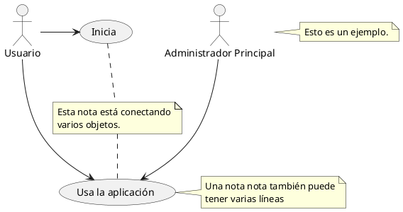

[Consultar visualización online](https://editor.plantuml.com/uml/NL2x3i8m3Dpp5IUcTg13nmu8FW0MO6CnhQ51gLCb0V7vv561X1Gvv_Fv76Vh0xdmd8pgzgG5ks7Iqe5yGQewUqOO6JJFHlSKj9KwbLEXLYf6X_K6rJ7vr4kUY5BFBf7uCM83m-dx661lPGewd4Rj4Gy9-4tJRBZvbvP-O8VCzr5Anjl8N1bMuFd5ZWoC5lQAPSYwnMML1sGOxzwAS1zuk4YmtqPxVKJIDwkqtw5LoqvecfGTsWJA8xRHFVtP1m00)

### Estereotipos

Puedes añadir estereotipos mientras defines actores y casos de uso, usando `<<` y `>>`.

```planuml
@startuml
Usuario << Humano >>
:base de datos Proncipal: as MySql << Aplicación >>
(Inicia) << Un intento >>
(Usa la aplicación) as (Usa) << Principal >>

Usuario -> (Inicia)
Usuario --> (Usa)

MySql --> (Usa)

@enduml
```

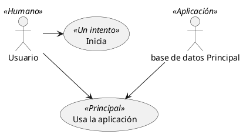

[Consultar visualización online](https://editor.plantuml.com/uml/JOun3eCm40HxlsBBKF01X2mYfQ11AImUS4bEmf8n11y5luSpI4bvkwFPQvBG8kiOJ9zuGLsZNKUAiDPK7Vc81mczA745IkWszmqAtUSv-3U9dp9wSsefj7b6XXicoV7XX0mC-k65UhJ8T9uuo7EzjBXCrws1eiQSotz1m_6ZR-y0)

### Cambio de dirección de las flechas

Por defecto, los enlaces entre clases tienen dos guiones `--` y están orientados verticalmente. Es posible utilizar un enlace horizontal poniendo un solo guión (o punto) como este

```planuml
@startuml
:Usuario: --> (Usa caso 1)
:Usuario: -> (Usa caso 2)
@enduml
```

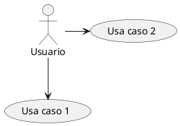

[Consultar visualización online](https://editor.plantuml.com/uml/SoWkIImgAStDuR8gBKujibBGrRLJq0WjJbL8JWGIXffmSMHX8qqkXzIy590s0000)

También se puede cambiar la dirección invirtiendo el enlace:

@startuml
(Usa caso 1) <.. :Usuario:
(Usa caso 2) <- :Usuario:
@enduml

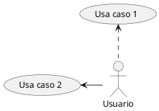

[Consultar visualización online](https://editor.plantuml.com/uml/SoWkIImgAStDuT88BKvLI4u44eQQ2ZPwUWfMfSMfHLP8uaP0SLsOi4DgNWf86m00)

También es posible cambiar la dirección de la flecha añadiendo las palabras clave `left`, `right`, `up` o `dow`n dentro de la flecha

```planuml
@startuml
:Usuario: -left-> (Izquierda)
:Usuario: -right-> (Derecha)
:Usuario: -up-> (Arriba)
:Usuario: -down-> (Abajo)
@enduml
```

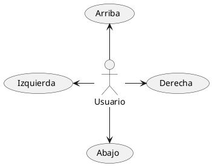

[Consultar visualización online](https://editor.plantuml.com/uml/SoWkIImgAStDuR8gBKujibBGpKbDAz6rKz18AStDhVG1SZJXKaMPwHa8kI0G3o5PMW2N2Ir02AVab-V19Lo074qkXzIy592D0000)

Puede acortar la flecha utilizando sólo el primer carácter de la dirección (por ejemplo, -d- en lugar de -down- ) o los dos primeros caracteres (-do-).
Tenga en cuenta que no debe abusar de esta funcionalidad : Graphviz suele dar buenos resultados sin retoques.

Y con el `left to right direction` parámetro

```planuml
@startuml
left to right direction
:Usuario: -left-> (Izquierda)
:Usuario: -right-> (Derecha)
:Usuario: -up-> (Arriba)
:Usuario: -down-> (Abajo)
@enduml
```

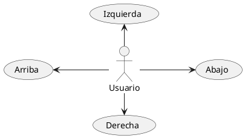

[Consultar visualización online](https://editor.plantuml.com/uml/SoWkIImgAStDuSf9JIjHACbNACfCpoXHICaiIaqkoSpFux8gBKujibBG1SdhsYbef9JcvbRw03cQS2cm5hXS48Y7a2mjWCk45Y24K_BBy-0IBa2E9fT3QbuAo2K0)

### Dividiendo los diagramas

La palabra clave `newpage` divide su diagrama en varias páginas o imágenes.@startuml

```planuml
:actor1: --> (Caso de uso 1)
newpage
:actor2: --> (Caso de uso 2)
@enduml
```

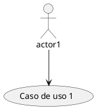

[Consultar visualización online](https://editor.plantuml.com/uml/SoWkIImgAStDuR9AJ2x9BpAqKj3LjLFG22rEJKuiJZNKvCfBBIz8J4-5oXkXoXjfSZcavgM0z0C0)

### Dirección: de izquierda a derecha

El comportamiento general cuando se construye un diagrama, es **top to bottom**.

```planuml
@startuml
'default
top to bottom direction
Usuario1 --> (Caso de uso 1)
Usuario2 --> (Caso de uso 2)

@enduml
```

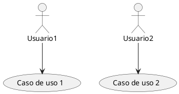

[Consultar visualización online](https://editor.plantuml.com/uml/SoWkIImgAStDuL9FIKrBBCqfuIh9Br0eoLT8oYyfoSzLICaiIaqkoSpFuoejJYqoLD3LjLFG22rEJKuiJbKmr0IB6g6A6cboSJcavgM0J0K0)

Puede cambiar a **left to righ**t usando el comando `left to right direction`. En ocaciones, el resultado es mejor con esta dirección.

```planuml
@startuml

left to right direction
Usuario1 --> (Caso de uso 1)
Usuario2 --> (Caso de uso 2)
@enduml
```

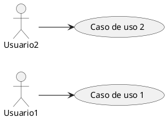

[Consultar visualización online](https://editor.plantuml.com/uml/SoWkIImgAStDuUBAIKqhKIZ9LoZAJCyeKKZ9B4fDBidCp-CgBKujCbJGrRLJq0WjJarEB4vLCDG4YngXYXffSd4vfEQbW4m30000)

> Hay más objetos que se pueden modificar dentro de Plant UML, sin embargo esto es lo que escencialmente necesitamos para la clase. Es usted libre de explorar su documentación y experimentar.

---

## Diagrama de clase

---

Los diagramas de clase se diseñan utilizando una sintaxis que refleja la empleada tradicionalmente en los lenguajes de programación. Este parecido fomenta un entorno familiar para los desarrolladores, facilitando así un proceso de creación de diagramas más sencillo e intuitivo.

Este enfoque de diseño no sólo es sucinto, sino que también permite crear representaciones que son a la vez concisas y expresivas. Por otra parte, permite la representación de las relaciones entre las clases a través de una sintaxis que se hace eco de la de los diagramas de secuencia, allanando el camino para una representación fluida y perspicaz de las interacciones de clase.

Más allá de las representaciones estructurales y relacionales, la sintaxis de los diagramas de clase soporta enriquecimientos adicionales, tales como la inclusión de notas y la aplicación de colores, permitiendo a los usuarios crear diagramas que son a la vez informativos y visualmente atractivos.

Usted puede aprender más acerca de [algunos de los comandos](https://plantuml.com/es/commons) comunes en PlantUML para mejorar su experiencia de creación de diagramas.

### Elemento declarante

```planuml
@startuml
abstract        Abstracta
abstract class  "clase abstracta" 
annotation      anotación
circle          círculo
()              círculo_corto
class           clase
class           class_stereo  <<stereotype>>
diamond         diamante
<>              diamante_forma_corta
entity          entidad
enum            enumeración
exception       excepción
interface       interfaz
metaclass       metaclass 
protocol        protocolo
stereotype      estereotipo
struct          estructura
@enduml
```

```plantuml
@startuml
abstract        Abstracta
abstract class  "clase abstracta" 
annotation      anotación
circle          círculo
()              círculo_corto
class           clase
class           class_stereo  <<stereotype>>
diamond         diamante
<>              diamante_forma_corta
entity          entidad
enum            enumeración
exception       excepción
interface       interfaz
metaclass       metaclass 
protocol        protocolo
stereotype      estereotipo
struct          estructura
@enduml
```

[Consultar visualización online](https://editor.plantuml.com/uml/RP5B2iCm34JtEeNfghr32Bb9K1s56cmhs0eqjs-CVmbKAxyP2NdG50M3xCu2lgC4rA9ALUw6jXYZKe-xy03qdWN5i2-JZK6Re2sfLfdX-LAtol8SFnnaNZauABjwH-B_wXo50h5Imv1VScmqZh0OTEoNrbmOXl6-lEZNxUJ5oD5RCf_oxgwJYO6-chOUNZK6uy_lhAXh_iRWIF2QfJ5iWOKrsxgYClHesUXyMc7lTqjMOfZ8B-cmFm00)

### Relación entre clases

Las relaciones entre clases se definen usando los siguientes símbolos:

| Tipo           | Símbolo | Finalidad                                          |
| -------------- | ------- | -------------------------------------------------- |
| Extensión      | `<--`   | Especialización de una clase en una jerarquía      |
| Implementación | `<..`   | Realización de una interfaz mediante una clase     |
| Composición    | `*--`   | La parte no puede existir sin el todo              |
| Agregación     | `o--`   | La parte puede existir independientemente del todo |
| Dependencia    | `-->`   | El objeto utiliza otro objeto                      |
| Dependencia    | `..>`   | Una forma más débil de dependencia                 |

Es posible intercambiar `-`- por `..` para tener lineas punteadas. Sabiendo esas reglas, es posible sacar los siguientes dibujos:

```planuml
@startuml
Class01 <|-- Class02
Class03 *-- Class04
Class05 o-- Class06
Class07 .. Class08
Class09 -- Class10
@enduml
```

```plantuml
@startuml
Class01 <|-- Class02
Class03 *-- Class04
Class05 o-- Class06
Class07 .. Class08
Class09 -- Class10
@enduml
```

[Consultar visualización online](https://editor.plantuml.com/uml/SoWkIImgAStDuNBEIImkDZ1KiAdHrLM0S8oWWiOAMd0n4wYOgK8-NCmCAcQkeAS75RA02bagm5GP6d0vfEQbWAm20000)

```plantuml
@staruml
Class11 <|.. Class12
Class13 --> Class14
Class15 ..> Class16
Class17 ..|> Class18
Class19 <--* Class20
@enduml
```

```plantuml
@startuml
Class11 <|.. Class12
Class13 --> Class14
Class15 ..> Class16
Class17 ..|> Class18
Class19 <--* Class20
@enduml
```

[Consultar visualización online](https://editor.plantuml.com/uml/SoWkIImgAStDuNBEIImkDZHKiAdHqrE0S8oWWiOAkhfsK34Jg9YfWfuUJCmCAcOE5Ak12Lf01IqLR7HrjI22HWPS3gbvAI3h0000)

```planuml
@startuml
Class21 #-- Class22
Class23 x-- Class24
Class25 }-- Class26
Class27 +-- Class28
Class29 ^-- Class30
@enduml
```

```plantuml
@startuml
Class21 #-- Class22
Class23 x-- Class24
Class25 }-- Class26
Class27 +-- Class28
Class29 ^-- Class30
@enduml
```

[Consultar visualización online](https://editor.plantuml.com/uml/SoWkIImgAStDuNBEIImkDZ9KKDRLLO2mZQ1YnWeLS34Jg9YfGYrSp0mgPgwW3HUpW8fPAiJ1n8mDk1nIyr90TW40)
