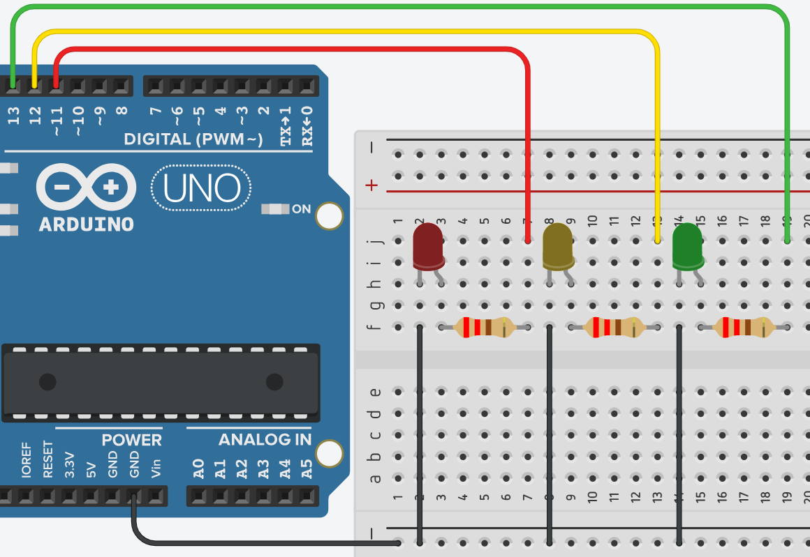

# **Prendido y apagado de leds ordenados - Declaración de Variables**



## **Explicación del código**

Este programa enciende y apaga tres LEDs (rojo, amarillo, verde) de forma secuencial, uno tras otro. Cada LED permanece encendido 300 ms y luego apagado 300 ms, pasando al siguiente. Es una introducción al uso de variables para almacenar números de pines y a la programación de secuencias temporales.

### **1. Declaración de variables globales**

```c++
//Bloque de Declaración 
const int led_red = 11;
int led_yellow = 12;
int led_green = 13;
```

- `const int led_red = 11;`: Declara una constante entera `led_red` con valor 11. La palabra `const` indica que este valor no cambiará durante la ejecución. Es una buena práctica para pines que no se modificarán.
- `int led_yellow = 12;`: Declara una variable entera normal `led_yellow` con valor 12. Aunque en este programa no se modifica, no se ha usado `const`. Puede cambiarse si se desea.
- `int led_green = 13;`: Similar al anterior, asigna el pin 13 al LED verde.
- **Ventaja de usar variables**: Facilitan la lectura del código y permiten cambiar el número de pin en un solo lugar si es necesario.

### **2. Configuración `setup()`**

```c++
void setup()
{
  pinMode(led_red, OUTPUT);
  pinMode(led_yellow, OUTPUT);
  pinMode(led_green, OUTPUT);  
}
```

- Cada pin se configura como salida (`OUTPUT`) para poder encender o apagar los LEDs mediante `digitalWrite()`.
- Es obligatorio hacer esto antes de usar `digitalWrite()` en esos pines.

### **3. Bucle `loop()`**

```c++
void loop()
{
  //leds intermitentes
  digitalWrite(led_red, HIGH);
  delay(300);
  digitalWrite(led_red, LOW);
  delay(300);
  digitalWrite(led_yellow, HIGH);
  delay(300);
  digitalWrite(led_yellow, LOW);
  delay(300);
  digitalWrite(led_green, HIGH);
  delay(300);
  digitalWrite(led_green, LOW);
  delay(300);
}
```

- `digitalWrite(pin, HIGH)` enciende el LED correspondiente (pone el pin a 5 V).
- `delay(300)` detiene el programa 300 milisegundos mientras el LED permanece encendido.
- `digitalWrite(pin, LOW)` apaga el LED (pin a 0 V).
- Nuevo `delay(300)` mantiene el LED apagado antes de pasar al siguiente.
- La secuencia completa es:
  1. LED rojo encendido 300 ms → apagado 300 ms
  2. LED amarillo encendido 300 ms → apagado 300 ms
  3. LED verde encendido 300 ms → apagado 300 ms
  4. El bucle se repite desde el principio.

**Observación:** Entre el apagado de un LED y el encendido del siguiente hay 300 ms de pausa, lo que produce una secuencia claramente diferenciada. Si se deseara un efecto de "desplazamiento" continuo (carrusel), se podría eliminar el `delay` después del apagado de cada LED, pero se perdería la separación visual.

### **Código completo para copiar y pegar**

```c++
// Prendido y apagado de leds ordenados - Declaración de Variables
// Resistencias de 220 ohm en serie con cada LED

const int led_red = 11;
int led_yellow = 12;
int led_green = 13;

void setup()
{
  pinMode(led_red, OUTPUT);
  pinMode(led_yellow, OUTPUT);
  pinMode(led_green, OUTPUT);  
}

void loop()
{
  digitalWrite(led_red, HIGH);
  delay(300);
  digitalWrite(led_red, LOW);
  delay(300);
  
  digitalWrite(led_yellow, HIGH);
  delay(300);
  digitalWrite(led_yellow, LOW);
  delay(300);
  
  digitalWrite(led_green, HIGH);
  delay(300);
  digitalWrite(led_green, LOW);
  delay(300);
}
```

### **Enlace al simulador**

[Código en Tinkercad](https://www.tinkercad.com/things/aTfUZXeMB4w-practica-02-p1-prendido-y-apagado-de-leds-ordenados-declaracion)

---

## **Preguntas teóricas**

1. ¿Cuál es la diferencia entre declarar un pin como `const int` y como `int`? ¿Por qué es recomendable usar `const` para pines que no cambian?
2. ¿Qué sucedería si en `setup()` configuramos un pin como `INPUT` y luego en `loop()` usamos `digitalWrite()` sobre él? Explica.
3. En el código actual, ¿cuánto tiempo tarda en completarse una iteración completa del `loop()` (desde que enciende el rojo hasta que apaga el verde)? Calcula el valor.
4. ¿Por qué es necesario usar resistencias en serie con los LEDs? ¿Qué valor se suele usar y cómo se calcula?
5. Si se cambian todos los `delay(300)` por `delay(100)`, ¿cómo afecta a la secuencia visual? ¿Se distinguen todavía los LEDs individuales?

---

## **Ejercicios prácticos (modificar el código y anotar cambios)**

**Instrucciones:** Copia el código original, realiza la modificación indicada, carga el programa en el simulador (o en Arduino real) y describe cómo cambia el comportamiento del circuito.

### **Ejercicio 1**
Invierte el orden de encendido: que primero encienda el LED verde, luego el amarillo y finalmente el rojo.
*Pregunta:* ¿Qué cambios observas? ¿El comportamiento secuencial sigue siendo el mismo pero en orden inverso?

### **Ejercicio 2**
Añade un cuarto LED azul en el pin 10 (con su resistencia de 220 Ω). Modifica el programa para que después del LED verde se encienda y apague el azul con el mismo patrón (300 ms encendido, 300 ms apagado).  
*Pregunta:* ¿Cuánto dura ahora una iteración completa del `loop()`? Describe la secuencia completa.

### **Ejercicio 3**
Cambia los tiempos para que cada LED esté encendido 500 ms pero apagado solo 100 ms (entre un LED y el siguiente).  
*Pregunta:* ¿Cómo se percibe la secuencia ahora? ¿Se nota superposición o sigue siendo claramente secuencial?

### **Ejercicio 4**
Elimina el `delay(300)` que aparece **después de apagar cada LED**, de manera que solo quede el delay después de encender cada LED.  
Ejemplo:  
```c++
digitalWrite(led_red, HIGH);
delay(300);
digitalWrite(led_red, LOW);
// delay(300);  // Eliminado
digitalWrite(led_yellow, HIGH);
delay(300);
...
```
*Pregunta:* ¿Qué efecto visual se produce? ¿Por qué ahora parece que hay dos LEDs encendidos al mismo tiempo en ciertos momentos?

### **Ejercicio 5**
Reemplaza todos los `digitalWrite` y `delay` por una estructura **sin usar variables repetitivas**, utilizando un arreglo (array) de pines y un bucle `for`.  
**Pista:** Declara `int pines[] = {11,12,13};` y recórrelo con `for`. Cada LED debe encenderse 300 ms y apagarse 300 ms antes de pasar al siguiente.  
*Pregunta:* ¿El programa funciona igual que el original? ¿Qué ventaja tiene usar un bucle `for` y un arreglo en términos de tamaño del código y facilidad para agregar más LEDs?

---

*Entregar las respuestas a las preguntas teóricas y la descripción de los cambios observados en cada ejercicio.*