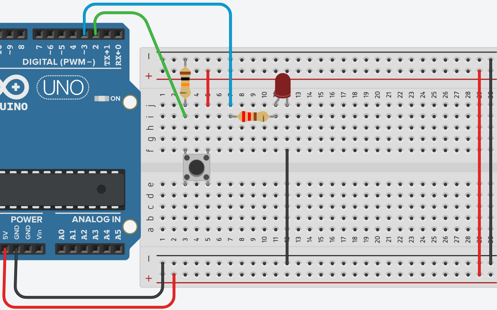

# **LED con Pulsador - IF**



## **Explicación del código**

Este programa implementa el control básico de un LED mediante un pulsador. Su objetivo es encender el LED mientras se mantiene presionado el botón y apagarlo cuando se suelta. Es una introducción a la lectura de entradas digitales y al uso de la estructura condicional `if` para tomar decisiones en el flujo del programa.

### **1. Declaración de variables globales**

```c++
int btn_e = 2;
int led_s = 3;
bool estado = LOW;
```

- `int btn_e = 2;`: Define el pin digital 2 como entrada para el pulsador.
- `int led_s = 3;`: Define el pin digital 3 como salida para el LED. Este pin tiene capacidad PWM, aunque en este programa solo se usa `digitalWrite()`.
- `bool estado = LOW;`: Declara una variable de tipo `bool` (booleana) llamada `estado` que almacena el estado actual del LED (apagado o encendido). Se inicializa en `LOW` (apagado). En este programa no se usa para mantener el estado entre ciclos, sino como preparación para futuras expansiones.

### **2. Configuración `setup()`**

```c++
void setup()
{
  pinMode(led_s, OUTPUT);
  pinMode(btn_e, INPUT);
}
```

- `pinMode(led_s, OUTPUT);`: Configura el pin del LED como salida digital para poder controlar su encendido y apagado.
- `pinMode(btn_e, INPUT);`: Configura el pin del pulsador como entrada. Para que la lectura sea estable, se debe conectar el pulsador con una resistencia externa de pull-down (10 kΩ a tierra) o usar la resistencia pull-up interna con `INPUT_PULLUP`.

### **3. Bucle `loop()` con estructura `if`**

```c++
void loop()
{
  //Presiono el botón y enciende led, suelto 
  // botón y se apaga el led
  if (digitalRead(btn_e) == HIGH)
  {
    digitalWrite(led_s, HIGH);
  }
  else 
  {
    digitalWrite(led_s, LOW);
  }
  
  //delay(1000);
}
```

#### **Lectura del pulsador**
- `if (digitalRead(btn_e) == HIGH)`: Comprueba si el pulsador está presionado. La función `digitalRead(btn_e)` lee el estado del pin del pulsador. Si el botón está presionado, el pin recibe `HIGH` (5V) y se ejecuta el bloque dentro del `if`.
- `digitalWrite(led_s, HIGH);`: Enciende el LED escribiendo un valor `HIGH` en el pin de salida.

#### **Estado cuando no se presiona**
- `else { digitalWrite(led_s, LOW); }`: Si el pulsador no está presionado (el `if` es falso), se ejecuta el bloque `else` y se apaga el LED escribiendo `LOW` en el pin.

#### **Comportamiento general**
El programa lee continuamente el estado del pulsador en cada ciclo del `loop()`. Mientras el botón esté presionado, el LED permanece encendido. Cuando se suelta, el LED se apaga inmediatamente. No hay efecto de "toggle" o memoria de estado; el LED refleja en tiempo real el estado del pulsador.

#### **Nota sobre el delay**
La línea `//delay(1000);` está comentada. Si se activara, introduciría una pausa de 1 segundo en cada ciclo del `loop()`, lo que provocaría que el LED tarde hasta 1 segundo en responder al cambio del pulsador, generando una sensación de lentitud o falta de respuesta inmediata.

### **Código completo para copiar y pegar**

```c++
// C++ code
//Bloque de Declaración 
int btn_e = 2;
int led_s = 3;
bool estado = LOW;
 
void setup()
{
  pinMode(led_s, OUTPUT);
  pinMode(btn_e, INPUT);
}

void loop()
{
  //Presiono el botón y enciende led, suelto 
  // botón y se apaga el led
  if (digitalRead(btn_e) == HIGH)
  {
    digitalWrite(led_s, HIGH);
  }
  else 
  {
    digitalWrite(led_s, LOW);
  }
  
  //delay(1000);
}
```

### **Enlace al simulador**

[Código en Tinkercad](https://www.tinkercad.com/things/dcOymPvmek8-practica-03-p2-led-con-pulsador-if)

---

## **Preguntas teóricas**

1. ¿Qué es una variable de tipo `bool`? ¿Qué valores puede almacenar y para qué se utiliza en este programa?
2. Explica el funcionamiento de la estructura `if` – `else` en el programa. ¿Qué ocurre si se omite el bloque `else`?
3. ¿Qué es el "rebote" (bouncing) de un pulsador? En este programa, ¿afecta el rebote al comportamiento del LED? ¿Por qué?
4. En el código, la línea `delay(1000);` está comentada. ¿Qué efecto tendría si se activara? ¿Por qué el programador decidió comentarla?
5. ¿Por qué es necesario configurar el pin del pulsador como `INPUT`? ¿Qué sucede si se configura como `OUTPUT` por error? Analiza las consecuencias.

---

## **Ejercicios prácticos (modificar el código y anotar cambios)**

**Instrucciones:** Para cada ejercicio, copia el código original, realiza la modificación indicada, carga el programa en el simulador (o en el Arduino real) y describe cómo cambia el comportamiento del circuito.

### **Ejercicio 1**
Modifica el programa para que el LED se encienda cuando **no** se presiona el pulsador y se apague cuando se presiona. (Pista: invierte la condición del `if` o los valores de `digitalWrite`).
*Pregunta:* ¿El comportamiento es el opuesto al original? ¿Se te ocurre una aplicación práctica para esta lógica invertida?

### **Ejercicio 2**
Agrega un segundo LED en el pin 4. Modifica el código para que el segundo LED se encienda únicamente cuando el pulsador **no** esté presionado (es decir, ambos LEDs tienen estados opuestos).
*Pregunta:* ¿Qué patrón de luces observas al presionar y soltar el botón?

### **Ejercicio 3**
Reemplaza el LED por un buzzer pasivo (zumbador) conectado al pin 3. Modifica el código para que el buzzer emita un tono mientras se mantenga presionado el pulsador.
*Pregunta:* ¿Qué función cumple `tone()` y qué parámetros recibe? ¿El comportamiento es análogo al del LED?

### **Ejercicio 4**
Elimina el `else` del programa, dejando solo el bloque `if` que enciende el LED cuando se presiona el botón.
*Pregunta:* ¿Qué ocurre con el LED cuando se suelta el pulsador? ¿Se apaga o queda en un estado indeterminado? Explica por qué.

### **Ejercicio 5**
Activa el `delay(1000);` (quita los comentarios) y observa el comportamiento.
*Pregunta:* ¿Cómo afecta el delay a la respuesta del LED? ¿El LED responde inmediatamente al presionar o soltar el botón? ¿Por qué?

---

*Entregar las respuestas a las preguntas teóricas y la descripción de los cambios observados en cada ejercicio.*