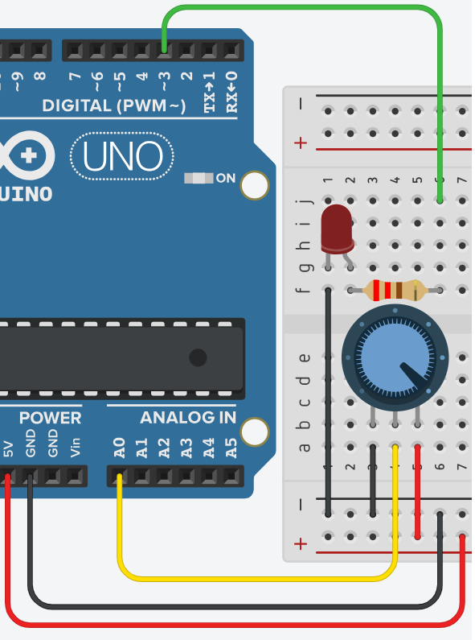

# **Intensidad LED - Potenciómetro**



## **Explicación del código**

Este programa controla la intensidad de un LED mediante un potenciómetro. Al girar la perilla, se lee el valor analógico (0-1023) y se convierte al rango PWM (0-255) para ajustar el brillo del LED.

### **1. Declaración de variables globales**

```cpp
int led_pwm = 3, brillo = 0, ptm = 0;
```

- `int led_pwm = 3;`: Pin PWM 3 para el LED.
- `int brillo = 0;`: Variable que almacenará el valor de brillo convertido (0-255).
- `int ptm = 0;`: Define la entrada analógica A0 para leer el potenciómetro. Las entradas analógicas no necesitan declararse con `pinMode()` porque por defecto son entradas.

### **2. Configuración `setup()`**

```cpp
void setup()
{
  pinMode(led_pwm, OUTPUT);
  Serial.begin(9600);
}
```

- `pinMode(led_pwm, OUTPUT);`: Configura el pin 3 como salida PWM.
- `Serial.begin(9600);`: Inicia la comunicación serie para visualizar el valor de brillo en el Monitor Serie.

### **3. Bucle `loop()`**

```cpp
void loop()
{
  brillo = analogRead(ptm) / 4;
  Serial.println(brillo);
  digitalWrite(led_pwm, brillo);
}
```

- `analogRead(ptm);`: Lee el valor analógico del potenciómetro (0 a 1023, que representa 0 a 5 V).
- `analogRead(ptm) / 4`: Divide entre 4 para convertir el rango 0-1023 al rango 0-255 del PWM. La división entre enteros trunca los decimales.
- `Serial.println(brillo);`: Muestra el valor de brillo actual en el Monitor Serie para depuración.
- `digitalWrite(led_pwm, brillo);`: **Nota:** En el código original se usa `digitalWrite()` con un valor PWM. Aunque `digitalWrite()` solo produce HIGH (5 V) o LOW (0 V), en algunos contextos se usa incorrectamente. Lo correcto sería `analogWrite()` para obtener brillo variable.

### **Código completo para copiar y pegar**

```cpp
// Intensidad LED - Potenciómetro

int led_pwm = 3, brillo = 0, ptm = 0;

void setup()
{
  pinMode(led_pwm, OUTPUT);
  Serial.begin(9600);
}

void loop()
{
  brillo = analogRead(ptm) / 4;
  Serial.println(brillo);
  digitalWrite(led_pwm, brillo);
}
```

### **Enlace al simulador**

[Código en Tinkercad](https://www.tinkercad.com/things/gxYQFVpLkst-practica-04-p2-intensidad-led-potenciometro)

---

## **Preguntas teóricas**

1. ¿Por qué el valor de `analogRead()` va de 0 a 1023? ¿Cuántos bits tiene el conversor ADC de Arduino?
2. ¿Por qué se divide entre 4 el valor leído del potenciómetro? ¿Qué relación hay entre 1023 y 255?
3. ¿Qué diferencia hay entre `analogWrite()` y `digitalWrite()`? ¿Funciona `digitalWrite()` para controlar brillo?
4. ¿Por qué las entradas analógicas no necesitan `pinMode()` en `setup()`?
5. ¿Qué voltaje corresponde a un valor de `analogRead()` de 512? ¿Y a 1023?

---

## **Ejercicios prácticos (modificar el código y anotar cambios)**

**Instrucciones:** Copia el código original, realiza la modificación indicada, carga el programa en el simulador (o en Arduino real) y describe cómo cambia el comportamiento del circuito.

### **Ejercicio 1**
Cambia `digitalWrite(led_pwm, brillo)` por `analogWrite(led_pwm, brillo)`.
*Pregunta:* ¿Se nota alguna diferencia en el brillo del LED? ¿Por qué?

### **Ejercicio 2**
Invierte el control: cuando el potenciómetro esté al mínimo, el LED debe brillar al máximo, y viceversa. Usa `map()` o la operación `255 - brillo`.
*Pregunta:* ¿Cuál método usaste? ¿El comportamiento es el esperado?

### **Ejercicio 3**
Agrega un segundo LED en el pin 5 que se comporte de forma inversa al primero (uno brilla más mientras el otro brilla menos).
*Pregunta:* ¿Cómo se ve el efecto visual al girar el potenciómetro?

### **Ejercicio 4**
Modifica el código para que el LED parpadee con una frecuencia controlada por el potenciómetro (frecuencia variable de 1 Hz a 10 Hz) en lugar de controlar el brillo.
*Pregunta:* ¿Cómo conviertes el valor del potenciómetro en un periodo de parpadeo?

### **Ejercicio 5**
Usa la función `map()` para mapear el valor del potenciómetro directamente al rango 0-255, en lugar de dividir entre 4.
*Pregunta:* ¿El resultado es idéntico? ¿Qué ventaja tiene `map()` frente a la división manual?

---

*Entregar las respuestas a las preguntas teóricas y la descripción de los cambios observados en cada ejercicio.*
