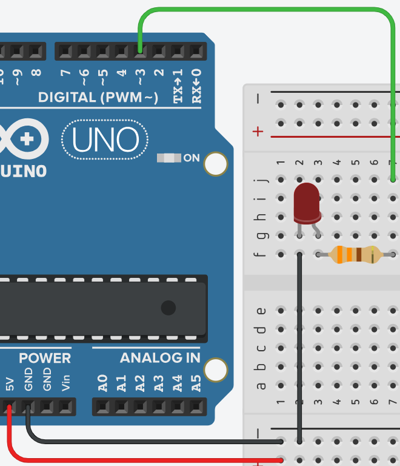

# **Controlar varios leds - SWITCH**



## **Explicación del código**

Este programa enciende aleatoriamente uno de tres LEDs (rojo, amarillo, verde) usando la estructura `switch-case`. Cada segundo se genera un número aleatorio entre 1 y 3 que determina qué LED se enciende.

### **1. Declaración de variables globales**

```cpp
int ledRd = 3, ledYllw = 5, ledGrn = 6;
```

- Se declaran tres variables enteras para los pines de los LEDs:
  - `ledRd = 3;`: LED rojo en pin 3.
  - `ledYllw = 5;`: LED amarillo en pin 5.
  - `ledGrn = 6;`: LED verde en pin 6.
- Usar variables con nombres descriptivos facilita la lectura y el mantenimiento del código.

### **2. Configuración `setup()`**

```cpp
void setup()
{
  pinMode(ledRd, OUTPUT);
  pinMode(ledYllw, OUTPUT);
  pinMode(ledGrn, OUTPUT);
}
```

- Cada pin se configura como salida (`OUTPUT`) para poder encender o apagar los LEDs.

### **3. Bucle `loop()`**

```cpp
void loop()
{
  int inicial = random(1, 4);
  switch(inicial){
    case 1:
      digitalWrite(ledRd, HIGH);
      digitalWrite(ledYllw, LOW);
      digitalWrite(ledGrn, LOW);
    break;
    case 2:
      digitalWrite(ledRd, LOW);
      digitalWrite(ledYllw, HIGH);
      digitalWrite(ledGrn, LOW);
    break;
    case 3:
      digitalWrite(ledRd, LOW);
      digitalWrite(ledYllw, LOW);
      digitalWrite(ledGrn, HIGH);
    break;
  }
  delay(1000);
}
```

- `random(1, 4);`: Genera un número aleatorio entre 1 y 3 (el límite superior 4 es exclusivo).
- `switch(inicial)`: Evalúa el valor de `inicial` y ejecuta el `case` correspondiente:
  - **case 1:** Enciende LED rojo, apaga amarillo y verde.
  - **case 2:** Enciende LED amarillo, apaga rojo y verde.
  - **case 3:** Enciende LED verde, apaga rojo y amarillo.
- `break;`: Cada `case` termina con `break` para salir del `switch` y evitar que se ejecuten los casos siguientes.
- `delay(1000);`: Mantiene el LED encendido durante 1 segundo antes de generar un nuevo número aleatorio.

### **Código completo para copiar y pegar**

```cpp
// Controlar varios leds - SWITCH

int ledRd = 3, ledYllw = 5, ledGrn = 6;

void setup()
{
  pinMode(ledRd, OUTPUT);
  pinMode(ledYllw, OUTPUT);
  pinMode(ledGrn, OUTPUT);
}

void loop()
{
  int inicial = random(1, 4);
  switch(inicial){
    case 1:
      digitalWrite(ledRd, HIGH);
      digitalWrite(ledYllw, LOW);
      digitalWrite(ledGrn, LOW);
    break;
    case 2:
      digitalWrite(ledRd, LOW);
      digitalWrite(ledYllw, HIGH);
      digitalWrite(ledGrn, LOW);
    break;
    case 3:
      digitalWrite(ledRd, LOW);
      digitalWrite(ledYllw, LOW);
      digitalWrite(ledGrn, HIGH);
    break;
  }
  delay(1000);
}
```

### **Enlace al simulador**

[Código en Tinkercad](https://www.tinkercad.com/things/5LJsFDHP1rS-practica-04-p3-controlar-varios-leds-switch)

---

## **Preguntas teóricas**

1. ¿Qué hace la función `random(1, 4)`? ¿Por qué el 4 es exclusivo y el 1 inclusivo?
2. ¿Qué sucede si se omiten los `break;` dentro del `switch`? Explica el concepto de *fall-through*.
3. ¿Qué diferencia hay entre la estructura `switch-case` y una serie de `if-else if`? ¿Cuándo conviene usar cada una?
4. ¿Por qué es necesario incluir `randomSeed()` en algunos casos? ¿Qué pasa si no se inicializa la semilla aleatoria?
5. ¿Cuánto tiempo tarda cada iteración del `loop()`? ¿El delay afecta a la generación del número aleatorio?

---

## **Ejercicios prácticos (modificar el código y anotar cambios)**

**Instrucciones:** Copia el código original, realiza la modificación indicada, carga el programa en el simulador (o en Arduino real) y describe cómo cambia el comportamiento del circuito.

### **Ejercicio 1**
Agrega un cuarto LED azul en el pin 9. Modifica el `switch` para que también pueda encender el azul, ampliando el rango de `random(1, 5)`.
*Pregunta:* ¿Qué casos agregaste? ¿Ahora hay 4 estados posibles?

### **Ejercicio 2**
Cambia el `delay(1000)` por `delay(200)` para que los LEDs cambien más rápido.
*Pregunta:* ¿Cómo se percibe el cambio? ¿Se pueden seguir distinguiendo los LEDs individualmente?

### **Ejercicio 3**
Modifica el programa para que en lugar de un solo LED, se enciendan dos LEDs simultáneamente en cada caso (ej. case 1: rojo+amarillo, case 2: amarillo+verde, case 3: verde+rojo).
*Pregunta:* ¿Cuántas combinaciones posibles hay? Describe los cambios en el `switch`.

### **Ejercicio 4**
Reemplaza la estructura `switch-case` por una serie de `if-else if` que haga exactamente lo mismo.
*Pregunta:* ¿Cuál de las dos versiones es más legible? ¿Hay diferencia en el comportamiento?

### **Ejercicio 5**
Agrega la función `randomSeed(analogRead(0))` en `setup()` y observa si la secuencia cambia al reiniciar el programa.
*Pregunta:* ¿Notas alguna diferencia en la secuencia de LEDs? ¿Por qué es importante inicializar la semilla aleatoria?

---

*Entregar las respuestas a las preguntas teóricas y la descripción de los cambios observados en cada ejercicio.*
