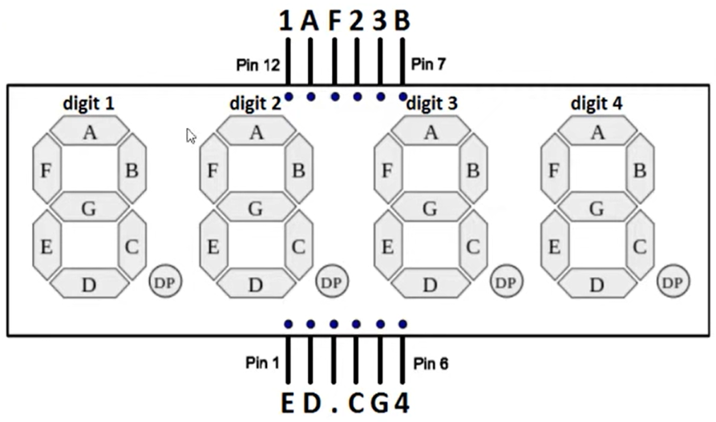

# **CONTADOR CON UN DISPLAY DE SIETE SEGMENTOS Y 4 DÍGITOS**



Para conectar el display de 7 segmentos y 4 dígitos 5461AS-1 a una placa Arduino Uno y controlar la velocidad con que aumentan los números usando un potenciómetro, además de usar un botón como reset, sigue el siguiente esquema de conexiones y el código proporcionado.

## **Explicación del código**

Este programa implementa un contador de 0 a 9999 en un display de 4 dígitos (5461AS-1). La velocidad de conteo se ajusta con un potenciómetro y un botón de reset permite reiniciar el contador. Utiliza multiplexación por dígitos para mostrar diferentes valores en cada posición.

### **1. Declaración de pines y variables**

```cpp
const int segmPins[8] = {2, 3, 4, 5, 6, 7, 8, 9};
const int pinD[4] = {10, 11, 12, 13};
const int resetButton = 14;
const int ptm = A0;

int num = 0;

const byte numeros[10] = {
  0b00111111, // 0
  0b00000110, // 1
  0b01011011, // 2
  0b01001111, // 3
  0b01100110, // 4
  0b01101101, // 5
  0b01111101, // 6
  0b00000111, // 7
  0b01111111, // 8
  0b01101111  // 9
};
```

- `segmPins[8]`: Pines para los segmentos A-G y DP.
- `pinD[4]`: Pines de control de los 4 dígitos.
- `resetButton = 14;`: Pin para el botón de reset.
- `ptm = A0;`: Pin analógico para el potenciómetro.
- `numeros[10]`: Arreglo de 10 bytes que codifica cada dígito del 0 al 9. El prefijo `0b` indica notación binaria. Cada bit representa un segmento (A, B, C, D, E, F, G, DP).

### **2. Configuración `setup()`**

```cpp
void setup() {
  for (int i = 0; i < 8; i++) {
    pinMode(segmPins[i], OUTPUT);
    digitalWrite(segmPins[i], LOW);
  }
  for (int i = 0; i < 4; i++) {
    pinMode(pinD[i], OUTPUT);
    digitalWrite(pinD[i], HIGH);
  }
  pinMode(resetButton, INPUT_PULLUP);
}
```

- Configura los pines de segmentos como salidas y los apaga.
- Configura los pines de dígitos como salidas y los desactiva.
- Configura el botón de reset como entrada con resistencia pull-up interna.

### **3. Bucle `loop()`**

```cpp
void loop() {
  if (digitalRead(resetButton) == LOW) {
    num = 0;
  }

  int delayTime = map(analogRead(ptm), 0, 1023, 100, 1000);

  for (int i = 0; i < 4; i++) {
    int digito = (num / (int)pow(10, i)) % 10;
    displaydigito(digito, i);
    delay(5);
  }

  delay(delayTime);
  num++;
  if (num > 9999) num = 0;
}
```

- Si el botón de reset está presionado (LOW), reinicia `num` a 0.
- `delayTime` se calcula del potenciómetro (100 a 1000 ms).
- El bucle `for` extrae cada dígito del número y lo muestra en la posición correspondiente usando multiplexación.
- Incrementa `num` y lo reinicia si supera 9999.

### **4. Función `displaydigito()`**

```cpp
void displaydigito(int digito, int posicion) {
  byte segmento = numeros[digito];
  for (int i = 0; i < 8; i++) {
    digitalWrite(segmPins[i], segmento & (1 << i));
  }
  digitalWrite(pinD[posicion], LOW);
  delay(2);
  digitalWrite(pinD[posicion], HIGH);
}
```

- Obtiene el patrón de segmentos del dígito desde el arreglo `numeros[]`.
- `segmento & (1 << i)`: Extrae cada bit del byte para determinar si encender el segmento `i`.
- Activa el dígito correspondiente (LOW), espera 2 ms, y lo desactiva.

### **Código completo para copiar y pegar**

```cpp
// Contador con Display 7 segmentos y 4 dígitos (5461AS-1)

const int segmPins[8] = {2, 3, 4, 5, 6, 7, 8, 9};
const int pinD[4] = {10, 11, 12, 13};
const int resetButton = 14;
const int ptm = A0;

int num = 0;

const byte numeros[10] = {
  0b00111111, // 0
  0b00000110, // 1
  0b01011011, // 2
  0b01001111, // 3
  0b01100110, // 4
  0b01101101, // 5
  0b01111101, // 6
  0b00000111, // 7
  0b01111111, // 8
  0b01101111  // 9
};

void setup() {
  for (int i = 0; i < 8; i++) {
    pinMode(segmPins[i], OUTPUT);
    digitalWrite(segmPins[i], LOW);
  }
  for (int i = 0; i < 4; i++) {
    pinMode(pinD[i], OUTPUT);
    digitalWrite(pinD[i], HIGH);
  }
  pinMode(resetButton, INPUT_PULLUP);
}

void loop() {
  if (digitalRead(resetButton) == LOW) {
    num = 0;
  }

  int delayTime = map(analogRead(ptm), 0, 1023, 100, 1000);

  for (int i = 0; i < 4; i++) {
    int digito = (num / (int)pow(10, i)) % 10;
    displaydigito(digito, i);
    delay(5);
  }

  delay(delayTime);
  num++;
  if (num > 9999) num = 0;
}

void displaydigito(int digito, int posicion) {
  byte segmento = numeros[digito];
  for (int i = 0; i < 8; i++) {
    digitalWrite(segmPins[i], segmento & (1 << i));
  }
  digitalWrite(pinD[posicion], LOW);
  delay(2);
  digitalWrite(pinD[posicion], HIGH);
}
```

### **Enlace al simulador**

[Código en Tinkercad](https://www.tinkercad.com/things/kYKOS14DgBW-practica-05-p4-display-7-segmentos-y-4-digitos)

---

## **Preguntas teóricas**

1. ¿Qué ventaja tiene codificar los segmentos en un byte usando notación binaria (`0b00111111`) frente a usar un arreglo de 7 `int`?
2. Explica cómo funciona `segmento & (1 << i)`. ¿Qué operadores bitwise se usan y qué producen?
3. ¿Por qué es necesario apagar un dígito antes de encender el siguiente en la multiplexación?
4. ¿Cuánta memoria RAM ahorra usar `const byte` en lugar de `int` para la matriz `numeros`?
5. ¿Qué ocurre si se elimina el `delay(5)` dentro del bucle de multiplexación?

---

## **Ejercicios prácticos (modificar el código y anotar cambios)**

**Instrucciones:** Copia el código original, realiza la modificación indicada, carga el programa en el simulador (o en Arduino real) y describe cómo cambia el comportamiento del circuito.

### **Ejercicio 1**
Cambia el sentido del conteo para que sea regresivo (de 9999 a 0) y que al llegar a 0 vuelva a 9999.
*Pregunta:* ¿Qué modificaciones hiciste en el `loop()`? ¿El botón de reset sigue funcionando correctamente?

### **Ejercicio 2**
Agrega un segundo botón en el pin 15 que, al presionarlo, reinicie el contador a un valor predefinido (ej. 5000) en lugar de 0.
*Pregunta:* ¿Cómo diferenciaste entre el botón de reset a 0 y el de reset a 5000?

### **Ejercicio 3**
Modifica la función `displaydigito()` para que el punto decimal del segundo dígito (posición 1) esté siempre encendido.
*Pregunta:* ¿Qué bit del byte de segmentos controla el punto decimal? ¿Cómo lo forzaste a encenderse?

### **Ejercicio 4**
Haz que el display muestre la temperatura ambiente usando un sensor LM35 en A5, en lugar del contador. Convierte el voltaje a grados Celsius (10 mV/°C).
*Pregunta:* ¿Cómo adaptaste el código para mostrar temperatura en lugar del contador? ¿Qué rango de temperatura puedes mostrar?

### **Ejercicio 5**
Elimina el uso de `pow()` reemplazándolo por divisiones sucesivas. Muestra el mismo funcionamiento sin la biblioteca `<math.h>`.
*Pregunta:* ¿Cómo extraes unidades, decenas, centenas y millares sin `pow()`? ¿El programa ocupa menos memoria?

---

*Entregar las respuestas a las preguntas teóricas y la descripción de los cambios observados en cada ejercicio.*
