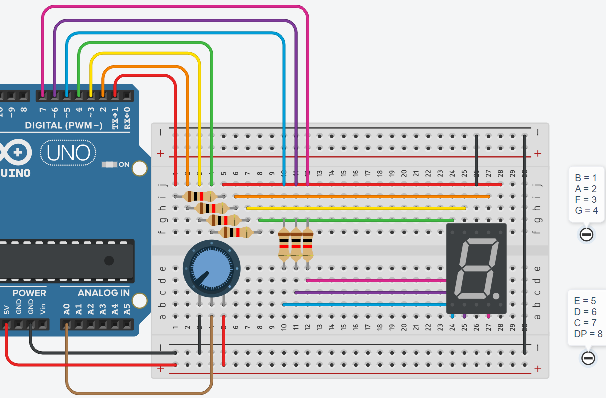

# **Display 7 segmentos - MATRICES**



## **Explicación del código**

Este programa lleva el concepto del P2 un paso más allá: en lugar de tener 8 arreglos individuales, utiliza una matriz bidimensional (8 filas × 7 columnas) para almacenar todos los patrones de los dígitos, eliminando por completo la necesidad del `switch-case`.

### **1. Declaración de constantes y la matriz**

```cpp
#define PTM A0

int i = 0, lectura = 0, num = 0;

int numeros[8][7] = {
  {HIGH, HIGH, HIGH, LOW, HIGH, HIGH, HIGH}, // 0
  {HIGH, LOW,  LOW,  LOW, LOW,  LOW,  HIGH}, // 1
  {HIGH, HIGH, LOW,  HIGH, HIGH, HIGH, LOW},  // 2
  {HIGH, HIGH, LOW,  HIGH, LOW,  HIGH, HIGH}, // 3
  {HIGH, LOW,  HIGH, HIGH, LOW,  LOW,  HIGH}, // 4
  {LOW,  HIGH, HIGH, HIGH, LOW,  HIGH, HIGH}, // 5
  {LOW,  LOW,  HIGH, HIGH, HIGH, HIGH, HIGH}, // 6
  {HIGH, HIGH, LOW,  LOW,  LOW,  LOW,  HIGH}  // 7
};
```

- `int numeros[8][7]`: Matriz de 8 filas (dígitos 0-7) y 7 columnas (segmentos A-G).
- Cada fila contiene el patrón de un dígito, donde la columna 0 corresponde al segmento A y la columna 6 al segmento G.
- Esta estructura permite acceder al patrón del dígito `num` con `numeros[num]` y al segmento individual con `numeros[num][i]`.

### **2. Configuración `setup()`**

```cpp
void setup()
{
  for (i = 0; i < 7; i++){
    pinMode(i, OUTPUT);
  }
}
```

- Configura los pines 0 a 6 como salidas para los 7 segmentos.

### **3. Bucle `loop()`**

```cpp
void loop()
{
  lectura = analogRead(PTM);
  num = map(lectura, 0, 1023, 0, 7);

  for (i = 0; i < 7; i++){
    digitalWrite(i, numeros[num][i]);
  }
}
```

- `analogRead(PTM)`: Lee el potenciómetro.
- `map(lectura, 0, 1023, 0, 7)`: Convierte al rango 0-7.
- `for (i = 0; i < 7; i++)`: Bucle que recorre los 7 segmentos.
- `digitalWrite(i, numeros[num][i])`: Escribe en el pin `i` el valor almacenado en la fila `num`, columna `i`.
- **Ventaja:** Todo el `switch-case` de 8 casos se reduce a un solo bucle `for` de 3 líneas. Para agregar más dígitos solo se añaden filas a la matriz.

### **Código completo para copiar y pegar**

```cpp
// Display 7 segmentos - MATRICES

#define PTM A0

int i = 0, lectura = 0, num = 0;

int numeros[8][7] = {
  {HIGH, HIGH, HIGH, LOW,  HIGH, HIGH, HIGH}, // 0
  {HIGH, LOW,  LOW,  LOW,  LOW,  LOW,  HIGH}, // 1
  {HIGH, HIGH, LOW,  HIGH, HIGH, HIGH, LOW},  // 2
  {HIGH, HIGH, LOW,  HIGH, LOW,  HIGH, HIGH}, // 3
  {HIGH, LOW,  HIGH, HIGH, LOW,  LOW,  HIGH}, // 4
  {LOW,  HIGH, HIGH, HIGH, LOW,  HIGH, HIGH}, // 5
  {LOW,  LOW,  HIGH, HIGH, HIGH, HIGH, HIGH}, // 6
  {HIGH, HIGH, LOW,  LOW,  LOW,  LOW,  HIGH}  // 7
};

void setup()
{
  for (i = 0; i < 7; i++){
    pinMode(i, OUTPUT);
  }
}

void loop()
{
  lectura = analogRead(PTM);
  num = map(lectura, 0, 1023, 0, 7);

  for (i = 0; i < 7; i++){
    digitalWrite(i, numeros[num][i]);
  }
}
```

### **Enlace al simulador**

[Código en Tinkercad](https://www.tinkercad.com/things/5hK4rFX78mk-practica-05-p3-display-7-segmentos-matrices)

---

## **Preguntas teóricas**

1. ¿Qué es una matriz bidimensional? ¿Cómo se declara y cómo se accede a sus elementos en C++?
2. ¿Cuánta memoria RAM ocupa la matriz `numeros[8][7]` si cada `int` ocupa 2 bytes?
3. ¿Qué ventajas tiene usar una matriz frente a 8 arreglos separados? ¿Y frente a un `switch-case`?
4. ¿Qué se necesita cambiar para agregar los dígitos 8 y 9 a la matriz?
5. ¿Por qué se usa `int` para almacenar `HIGH`/`LOW`? ¿Se podría usar `byte` o `bool` para ahorrar memoria?

---

## **Ejercicios prácticos (modificar el código y anotar cambios)**

**Instrucciones:** Copia el código original, realiza la modificación indicada, carga el programa en el simulador (o en Arduino real) y describe cómo cambia el comportamiento del circuito.

### **Ejercicio 1**
Expande la matriz para incluir los dígitos 8 y 9. Cambia el `map()` para que el rango sea 0-9.
*Pregunta:* ¿Cuántas filas agregaste? ¿La matriz ahora es `[10][7]`?

### **Ejercicio 2**
Haz que el display muestre todos los dígitos del 0 al 9 en secuencia automática con un `delay(500)`, sin usar el potenciómetro.
*Pregunta:* ¿Cómo reemplazaste la lectura analógica? ¿Usaste un contador con `++`?

### **Ejercicio 3**
Agrega un segundo display de 7 segmentos usando los pines 8-14, y haz que ambos muestren el mismo dígito simultáneamente. Define una segunda matriz de pines y usa dos bucles.
*Pregunta:* ¿Los dos displays muestran el mismo número? ¿Cómo sincronizas ambos?

### **Ejercicio 4**
Crea un efecto de "carrusel" donde el dígito mostrado se desplace: muestra el 0 por 1 s, luego todos los segmentos apagados por 200 ms, luego el 1 por 1 s, etc.
*Pregunta:* ¿Cómo implementaste la pausa intermedia? ¿Agregaste un estado "apagado"?

### **Ejercicio 5**
Cambia la matriz para que use `byte` en lugar de `int` y observa si el comportamiento es el mismo. Luego cambia a `const byte` y justifica por qué es mejor.
*Pregunta:* ¿Cuánta memoria ahorraste? ¿Por qué es recomendable usar `const` para datos que no cambian?

---

*Entregar las respuestas a las preguntas teóricas y la descripción de los cambios observados en cada ejercicio.*
