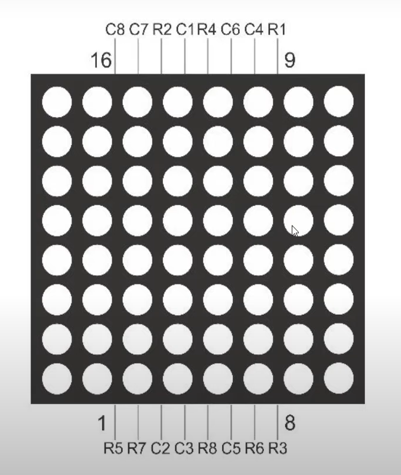

# **Uso de la matrix 8x8**



## **Explicación del código**

Este programa controla una matriz LED de 8×8 para encender cada LED individualmente en secuencia, recorriendo filas y columnas. Sirve como introducción al direccionamiento de matrices LED mediante multiplexación.

### **1. Declaración de pines**

```cpp
const int colPins[8] = {0, 1, 3, 10, 11, 6, 13, 5};
const int rowPins[8] = {7, 2, 4, 8, A0, 9, A1, 12};
```

- `colPins[8]`: Pines para controlar las 8 columnas (C1-C8) de la matriz.
- `rowPins[8]`: Pines para controlar las 8 filas (R1-R8) de la matriz.
- Cada combinación de fila y columna permite encender un LED específico.
- Se usan también los pines analógicos A0 y A1 como pines digitales para filas adicionales.

### **2. Configuración `setup()`**

```cpp
void setup() {
  for (int i = 0; i < 8; i++) {
    pinMode(colPins[i], OUTPUT);
    digitalWrite(colPins[i], HIGH);
  }
  for (int i = 0; i < 8; i++) {
    pinMode(rowPins[i], OUTPUT);
    digitalWrite(rowPins[i], LOW);
  }
}
```

- Configura todas las columnas como salidas y las pone en HIGH (columnas apagadas).
- Configura todas las filas como salidas y las pone en LOW (filas apagadas).
- En una matriz LED de cátodo común, la columna activa es LOW y la fila activa es HIGH.

### **3. Bucle `loop()`**

```cpp
void loop() {
  for (int row = 0; row < 8; row++) {
    for (int col = 0; col < 8; col++) {
      lightLed(row, col);
      delay(100);
      clearLed(row, col);
    }
  }
}
```

- Dos bucles `for` anidados recorren las 64 combinaciones de fila y columna.
- `lightLed(row, col)`: Enciende el LED en la posición indicada.
- `delay(100)`: Mantiene el LED encendido 100 ms.
- `clearLed(row, col)`: Apaga el LED antes de pasar al siguiente.

### **4. Funciones auxiliares**

```cpp
void lightLed(int row, int col) {
  digitalWrite(colPins[col], LOW);
  digitalWrite(rowPins[row], HIGH);
}

void clearLed(int row, int col) {
  digitalWrite(colPins[col], HIGH);
  digitalWrite(rowPins[row], LOW);
}
```

- `lightLed()`: Activa la columna (LOW) y la fila (HIGH) para encender el LED en la intersección.
- `clearLed()`: Desactiva la columna (HIGH) y la fila (LOW) para apagar el LED.
- **Nota:** La lógica (columna activa en LOW, fila activa en HIGH) depende del tipo de matriz y la conexión. En este caso corresponde a una matriz con cátodos en columnas y ánodos en filas.

### **Esquema de conexiones**

| Pin Matriz | Ubicación | Pin Arduino |
|------------|-----------|-------------|
| C1         | Columna 8 | Pin 0       |
| C2         | Columna 7 | Pin 1       |
| C3         | Columna 1 | Pin 3       |
| C4         | Columna 2 | Pin 10      |
| C5         | Columna 3 | Pin 11      |
| C6         | Columna 4 | Pin 6       |
| C7         | Columna 5 | Pin 13      |
| C8         | Columna 6 | Pin 5       |
| R1         | Fila 1    | Pin 7       |
| R2         | Fila 2    | Pin 2       |
| R3         | Fila 3    | A0          |
| R4         | Fila 4    | Pin 4       |
| R5         | Fila 5    | Pin 8       |
| R6         | Fila 6    | A1          |
| R7         | Fila 7    | Pin 9       |
| R8         | Fila 8    | Pin 12      |


En cada fila se conecta una resistencia de 330 ohms.

### **Código completo para copiar y pegar**

```cpp
// Uso de la matriz 8x8

const int colPins[8] = {0, 1, 3, 10, 11, 6, 13, 5};
const int rowPins[8] = {7, 2, 4, 8, A0, 9, A1, 12};

void setup() {
  for (int i = 0; i < 8; i++) {
    pinMode(colPins[i], OUTPUT);
    digitalWrite(colPins[i], HIGH);
  }
  for (int i = 0; i < 8; i++) {
    pinMode(rowPins[i], OUTPUT);
    digitalWrite(rowPins[i], LOW);
  }
}

void loop() {
  for (int row = 0; row < 8; row++) {
    for (int col = 0; col < 8; col++) {
      lightLed(row, col);
      delay(100);
      clearLed(row, col);
    }
  }
}

void lightLed(int row, int col) {
  digitalWrite(colPins[col], LOW);
  digitalWrite(rowPins[row], HIGH);
}

void clearLed(int row, int col) {
  digitalWrite(colPins[col], HIGH);
  digitalWrite(rowPins[row], LOW);
}
```

---

## **Preguntas teóricas**

1. ¿Qué es una matriz LED de 8×8? ¿Cuántos LEDs contiene y cómo se direccionan?
2. Explica el principio de multiplexación aplicado a una matriz LED. ¿Por qué no se pueden encender todos los LEDs a la vez?
3. ¿Qué función cumplen las resistencias de 330 ohms en cada fila? ¿Cómo se calcula su valor?
4. ¿Por qué se usan pines analógicos (A0, A1) como salidas digitales? ¿Todos los pines analógicos pueden funcionar como digitales?
5. ¿Cuánto tiempo tarda el programa en recorrer los 64 LEDs si cada uno permanece 100 ms encendido?

---

## **Ejercicios prácticos (modificar el código y anotar cambios)**

**Instrucciones:** Copia el código original, realiza la modificación indicada, carga el programa en el simulador (o en Arduino real) y describe cómo cambia el comportamiento del circuito.

### **Ejercicio 1**
Cambia el orden de recorrido para que los LEDs se enciendan por columnas en lugar de por filas.
*Pregunta:* ¿Cómo modificaste los bucles anidados? ¿Se nota alguna diferencia visual?

### **Ejercicio 2**
Haz que se encienda una "X" en la matriz (todas las LEDs de las diagonales principales) sin recorrer todas las posiciones.
*Pregunta:* ¿Qué condición deben cumplir `row` y `col` para estar en una diagonal? ¿Usaste `if` dentro del bucle?

### **Ejercicio 3**
Reduce el `delay(100)` a `delay(10)`. ¿Cómo se percibe el barrido? Luego pruébalo sin delay.
*Pregunta:* ¿A partir de qué valor el ojo humano percibe el barrido como un patrón fijo?

### **Ejercicio 4**
Haz que se encienda un cuadrado de 2×2 que se mueva en zigzag por la matriz (como un "píxel" que viaja).
*Pregunta:* ¿Cómo implementaste el movimiento del cuadrado? ¿Usaste variables de posición que se actualizan?

### **Ejercicio 5**
Crea un patrón de "ola" que cruce la matriz: una línea diagonal que se mueve desde la esquina superior izquierda a la inferior derecha.
*Pregunta:* ¿Qué relación entre `row` y `col` usaste para la diagonal? ¿Cómo actualizas la posición para simular el movimiento?

---

*Entregar las respuestas a las preguntas teóricas y la descripción de los cambios observados en cada ejercicio.*
