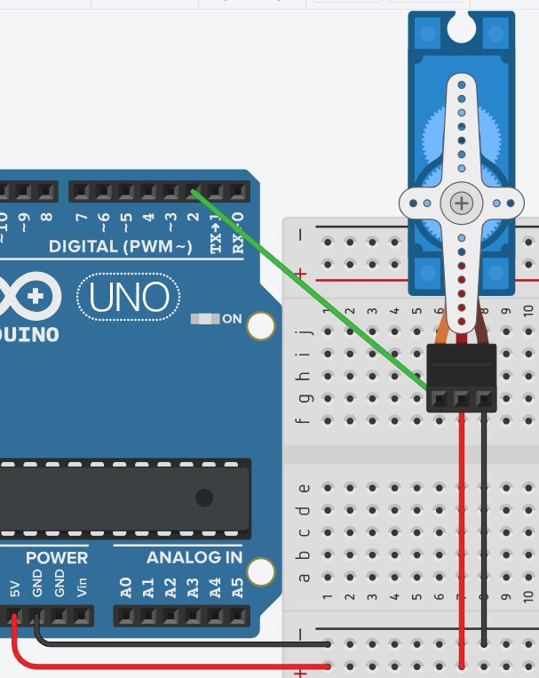

# **Servomotor - Heads**



## **Explicación del código**

Este programa controla un servomotor para que oscile entre 0° y 180° de forma continua. Sirve como introducción al uso de la librería Servo y la configuración de pulsos mínimos y máximos para definir el rango de movimiento.

### **1. Inclusión de la librería y creación del objeto Servo**

```cpp
#include <Servo.h>
Servo servo1;
```

- `#include <Servo.h>`: Incluye la librería estándar de Arduino para controlar servomotores. Contiene la clase `Servo` y sus métodos.
- `Servo servo1;`: Declara un objeto `servo1` de tipo `Servo`. Este objeto nos permite controlar un servomotor específico mediante sus métodos (`attach()`, `write()`, etc.).

### **2. Declaración de constantes**

```cpp
const int SERVO = 2;
const int PULSO_MIN = 500;
const int PULSO_MAX = 800;
```

- `const int SERVO = 2;`: Define el pin digital 2 como la señal de control del servo.
- `const int PULSO_MIN = 500;`: Define la duración del pulso mínimo (en microsegundos) que corresponde a 0°. El valor típico es 500 µs.
- `const int PULSO_MAX = 800;`: Define la duración del pulso máximo que corresponde a 180°. El valor típico es 2400 µs, pero en el simulador se usan 800 µs para este modelo.
- **Nota:** Los valores de pulso dependen del fabricante del servo. Se recomienda empezar con 1000 y 2000 como valores de prueba para mínimo y máximo.

### **3. Configuración `setup()`**

```cpp
void setup()
{
  servo1.attach(SERVO, PULSO_MIN, PULSO_MAX);
}
```

- `servo1.attach(SERVO, PULSO_MIN, PULSO_MAX);`: Asocia el objeto `servo1` al pin definido y configura los límites de pulso. El servo comenzará en la posición de 0° (pulso mínimo).

### **4. Bucle `loop()`**

```cpp
void loop()
{
  servo1.write(0);
  delay(2000);
  servo1.write(180);
  delay(2000);
}
```

- `servo1.write(0);`: Envía una señal al servo para que se posicione en 0 grados.
- `delay(2000);`: Mantiene la posición durante 2 segundos.
- `servo1.write(180);`: Envía una señal al servo para que se posicione en 180 grados.
- `delay(2000);`: Mantiene la posición durante 2 segundos.
- El ciclo se repite infinitamente, generando un movimiento de barrido de 0° a 180° y viceversa.
- **Advertencia:** La mayoría de los servos estándar no pueden girar 360° completos. Intentar forzarlos más allá de 0° o 180° puede dañarlos.

### **Código completo para copiar y pegar**

```cpp
// Servomotor - Heads
// Cuidado con los servos: algunos requieren 7.5-12V
// Se recomienda fuente externa de 7.8-12V, 750 mA

#include <Servo.h>
Servo servo1;

const int SERVO = 2;
const int PULSO_MIN = 500;
const int PULSO_MAX = 800;

int angulo = 0;

void setup()
{
  servo1.attach(SERVO, PULSO_MIN, PULSO_MAX);
}

void loop()
{
  servo1.write(0);
  delay(2000);
  servo1.write(180);
  delay(2000);
}
```

### **Enlace al simulador**

[Código en Tinkercad](https://www.tinkercad.com/things/hQc1mxozhRq-practica-07-p1-control-de-servomotor-heads)

---

## **Preguntas teóricas**

1. ¿Qué función cumple `Servo.attach(pin, min, max)` y por qué es necesario llamarla en `setup()`?
2. ¿Qué diferencia hay entre un servo estándar (0° a 180°) y un servo de rotación continua? ¿Cómo se refleja en el código?
3. ¿Qué ocurriría si se asigna un valor fuera del rango 0-180 en `servo1.write()`? ¿El servo lo ignorará o podría dañarse?
4. ¿Por qué los valores de pulso mínimo y máximo varían entre distintos modelos de servos? ¿Cómo se pueden determinar experimentalmente?
5. ¿Qué función cumple el delay de 2 segundos entre cada posición? ¿Qué pasaría si se reduce a 10 ms?

---

## **Ejercicios prácticos (modificar el código y anotar cambios)**

**Instrucciones:** Copia el código original, realiza la modificación indicada, carga el programa en el simulador (o en Arduino real) y describe cómo cambia el comportamiento del circuito.

### **Ejercicio 1**
Cambia el rango de movimiento para que el servo oscile entre 45° y 135° en lugar de 0° a 180°.
*Pregunta:* ¿Cómo cambia el movimiento? ¿El servo se mueve más rápido entre estas posiciones?

### **Ejercicio 2**
Agrega una posición intermedia de 90° con un delay de 1 segundo entre cada movimiento, de modo que la secuencia sea: 0° → 90° → 180° → 90° → 0°.
*Pregunta:* Describe la secuencia completa. ¿Cuánto tarda ahora una iteración del `loop()`?

### **Ejercicio 3**
Reduce el delay entre posiciones a 500 ms. Luego a 100 ms. Prueba también con 20 ms.
*Pregunta:* ¿A partir de qué valor el movimiento deja de verse como pasos discretos y se percibe como un barrido continuo?

### **Ejercicio 4**
Conecta un segundo servomotor en el pin 3 con los mismos valores de pulso. Haz que el servo 1 se mueva de 0° a 180° mientras el servo 2 se mueve de 180° a 0° (movimiento en espejo).
*Pregunta:* ¿Cómo coordinas los dos servos en el código? ¿Qué patrón de movimiento observas?

### **Ejercicio 5**
Reemplaza los valores fijos de `write()` por un barrido progresivo usando un bucle `for` que incremente el ángulo de 1 en 1 con un `delay(15)` entre cada paso, de 0° a 180° y luego de vuelta a 0°.
*Pregunta:* ¿Qué ventaja tiene este método frente a usar posiciones fijas? ¿Cómo se percibe el movimiento?

---

*Entregar en su cuaderno las respuestas a las preguntas teóricas y la descripción de los cambios observados en cada ejercicio.*
