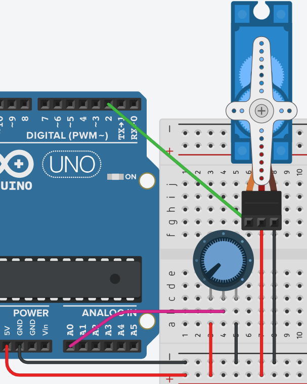

# **Control de Servomotor**



## **Explicación del código**

Este programa controla la posición de un servomotor mediante un potenciómetro. Al girar la perilla del potenciómetro, el servo se mueve al ángulo correspondiente, permitiendo un control manual y continuo de la posición.

### **1. Declaración de objetos y variables**

```cpp
#include <Servo.h>
Servo servo1;

const int SERVO = 2;
const int PULSO_MIN = 500;
const int PULSO_MAX = 800;

const int PTM = 0;
int valor_ptm = 0;
int angulo = 0;
```

- `#include <Servo.h>` y `Servo servo1;`: Incluye la librería y crea el objeto para controlar el servomotor.
- `const int SERVO = 2;`: Pin de señal para el servo.
- `const int PULSO_MIN = 500;` y `PULSO_MAX = 800;`: Definen el rango de pulsos para 0° y 180° respectivamente.
- `const int PTM = 0;`: Define la entrada analógica A0 para leer el potenciómetro.
- `int valor_ptm = 0;`: Variable que almacenará el valor leído del potenciómetro (0 a 1023).
- `int angulo = 0;`: Variable que almacenará el ángulo calculado (0 a 180).

### **2. Configuración `setup()`**

```cpp
void setup()
{
  servo1.attach(SERVO, PULSO_MIN, PULSO_MAX);
}
```

- `servo1.attach(SERVO, PULSO_MIN, PULSO_MAX);`: Conecta el objeto servo al pin 2 con los límites de pulso definidos. Esta configuración solo se ejecuta una vez al iniciar.

### **3. Bucle `loop()`**

```cpp
void loop()
{
  valor_ptm = analogRead(PTM);
  angulo = map(valor_ptm, 0, 1023, 0, 180);
  servo1.write(angulo);
  delay(20);
}
```

- `analogRead(PTM);`: Lee el valor analógico del potenciómetro conectado a A0. Devuelve un valor entre 0 y 1023.
- `map(valor_ptm, 0, 1023, 0, 180);`: Convierte (mapea) el valor leído (0-1023) al rango de ángulos (0-180). La función `map` toma cinco argumentos: (valor a convertir, mínimo fuente, máximo fuente, mínimo destino, máximo destino).
- `servo1.write(angulo);`: Envía el ángulo calculado al servo, que se posiciona inmediatamente.
- `delay(20);`: Pausa de 20 ms para dar tiempo al servo de alcanzar la posición. Este valor debe aumentarse proporcionalmente al peso que mueve el servo.
- El bucle se repite continuamente, actualizando la posición del servo en tiempo real según la posición del potenciómetro.

### **Código completo para copiar y pegar**

```cpp
// Control de Servomotor con potenciómetro

#include <Servo.h>
Servo servo1;

const int SERVO = 2;
const int PULSO_MIN = 500;
const int PULSO_MAX = 800;

const int PTM = 0;
int valor_ptm = 0;
int angulo = 0;

void setup()
{
  servo1.attach(SERVO, PULSO_MIN, PULSO_MAX);
}

void loop()
{
  valor_ptm = analogRead(PTM);
  angulo = map(valor_ptm, 0, 1023, 0, 180);
  servo1.write(angulo);
  delay(20);
}
```

### **Enlace al simulador**

[Código en Tinkercad](https://www.tinkercad.com/things/8osopeAd574-practica-07-p2-control-de-servomotor-heads)

---

## **Preguntas teóricas**

1. ¿Qué hace la función `map()`? Explica cada uno de sus cinco parámetros.
2. ¿Por qué el valor máximo de `analogRead()` es 1023 y no 1024? ¿Cuántos bits tiene el conversor analógico-digital de Arduino?
3. ¿Qué sucedería si se elimina el `delay(20)` del `loop()`? ¿El servo funcionaría correctamente?
4. ¿Qué ventaja tiene controlar un servo con un potenciómetro frente a usar valores fijos en el código?
5. ¿Qué rango de voltaje esperas medir en el pin A0 cuando el potenciómetro está al mínimo y al máximo?

---

## **Ejercicios prácticos (modificar el código y anotar cambios)**

**Instrucciones:** Copia el código original, realiza la modificación indicada, carga el programa en el simulador (o en Arduino real) y describe cómo cambia el comportamiento del circuito.

### **Ejercicio 1**
Cambia el mapeo para que el potenciómetro controle el servo en el rango de 30° a 150° en lugar de 0° a 180°.
*Pregunta:* ¿Qué ángulos se pierden? ¿El movimiento se siente más o menos preciso?

### **Ejercicio 2**
Invierte el sentido de control: cuando el potenciómetro esté al mínimo (0), el servo debe ir a 180°, y cuando esté al máximo (1023), debe ir a 0°.
*Pregunta:* ¿Cómo modificaste el `map()`? ¿El comportamiento es el esperado?

### **Ejercicio 3**
Agrega un LED en el pin 13 que se encienda cuando el ángulo del servo sea mayor a 90°.
*Pregunta:* ¿En qué posición del potenciómetro se enciende el LED? ¿Hay histéresis o titila en el límite?

### **Ejercicio 4**
Conecta un segundo potenciómetro en A1 y un segundo servo en el pin 3. Controla cada servo de forma independiente con su respectivo potenciómetro.
*Pregunta:* ¿Cómo se organiza el código para leer dos potenciómetros y controlar dos servos?

### **Ejercicio 5**
Agrega una zona muerta (dead band) en el centro: cuando el ángulo calculado esté entre 85° y 95°, el servo debe permanecer en 90° sin importar las variaciones del potenciómetro.
*Pregunta:* ¿Qué efecto tiene esta zona muerta en el control manual? ¿Por qué es útil en aplicaciones industriales?

---

*Entregar las respuestas a las preguntas teóricas y la descripción de los cambios observados en cada ejercicio.*
