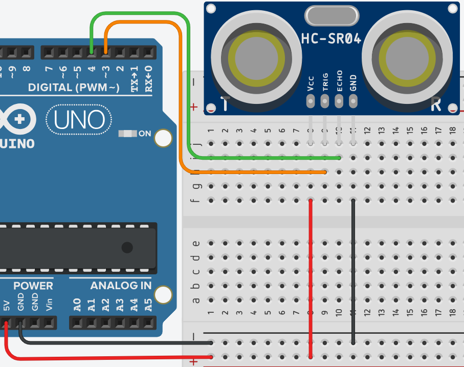

# **Sensor de distancia**



## **Explicación del código**

Este programa utiliza un sensor ultrasónico HC-SR04 para medir distancia. El sensor emite un pulso ultrasónico y mide el tiempo que tarda en regresar, calculando la distancia en centímetros. Los valores se muestran en el Monitor Serie.

### **1. Declaración de variables globales**

```cpp
const int echo = 4, trig = 3;
int time = 0;
float distancia = 0;
```

- `const int echo = 4, trig = 3;`: Define los pines del sensor. `trig` (pin 3) se usa para disparar el pulso ultrasónico, y `echo` (pin 4) recibe el pulso de retorno.
- `int time = 0;`: Variable para almacenar el tiempo de ida y vuelta del pulso ultrasónico, medido en microsegundos.
- `float distancia = 0;`: Variable para almacenar la distancia calculada en centímetros. Se usa `float` para permitir decimales.

### **2. Configuración `setup()`**

```cpp
void setup()
{
  Serial.begin(9600);
  pinMode(echo, INPUT);
  pinMode(trig, OUTPUT);
}
```

- `Serial.begin(9600);`: Inicia la comunicación serie a 9600 baudios para mostrar los valores en el Monitor Serie.
- `pinMode(echo, INPUT);`: Configura el pin `echo` como entrada para leer el pulso de retorno.
- `pinMode(trig, OUTPUT);`: Configura el pin `trig` como salida para generar el pulso de disparo.

### **3. Bucle `loop()`**

```cpp
void loop()
{
  digitalWrite(trig, HIGH);
  delay(1);
  digitalWrite(trig, LOW);

  time = pulseIn(echo, HIGH);
  distancia = time / 58.2;

  Serial.print("tiempo= ");
  Serial.print(time);
  Serial.print("\t distancia= ");
  Serial.println(distancia);
}
```

- `digitalWrite(trig, HIGH);`: Envía un pulso HIGH de 1 ms al pin `trig` para iniciar la medición.
- `delay(1);` y `digitalWrite(trig, LOW);`: Mantiene el pulso HIGH durante 1 ms y luego lo apaga.
- `pulseIn(echo, HIGH);`: Mide la duración (en microsegundos) del pulso HIGH recibido en el pin `echo`. Este tiempo corresponde al viaje de ida y vuelta del sonido.
- `distancia = time / 58.2;`: Convierte el tiempo en distancia. La fórmula se basa en la velocidad del sonido (343 m/s): distancia = tiempo / 58.2 (para obtener cm). El factor 58.2 proviene de 2 × 100 / 343 × 1000.
- `Serial.print()` y `Serial.println()`: Envían al Monitor Serie el tiempo medido y la distancia calculada, separados por un tabulador (`\t`).

### **Código completo para copiar y pegar**

```cpp
// Sensor de distancia ultrasónico HC-SR04

const int echo = 4, trig = 3;
int time = 0;
float distancia = 0;

void setup()
{
  Serial.begin(9600);
  pinMode(echo, INPUT);
  pinMode(trig, OUTPUT);
}

void loop()
{
  digitalWrite(trig, HIGH);
  delay(1);
  digitalWrite(trig, LOW);

  time = pulseIn(echo, HIGH);
  distancia = time / 58.2;

  Serial.print("tiempo= ");
  Serial.print(time);
  Serial.print("\t distancia= ");
  Serial.println(distancia);
}
```

### **Enlace al simulador**

[Código en Tinkercad](https://www.tinkercad.com/things/dTtCy72ybhb-practica-07-p3-sensor-de-distancia)

---

## **Preguntas teóricas**

1. ¿Cómo funciona el sensor ultrasónico HC-SR04? Explica el principio de emisión y recepción de pulsos.
2. ¿Por qué se divide el tiempo entre 58.2 para obtener la distancia en centímetros? Deduce la fórmula a partir de la velocidad del sonido.
3. ¿Qué rango de distancias puede medir el HC-SR04 según su hoja de datos? ¿Qué factores limitan la medición a corta y larga distancia?
4. ¿Qué diferencia hay entre `Serial.print()` y `Serial.println()`? ¿Qué función cumple `\t` en la salida?
5. ¿Qué sucedería si se usara `int distancia` en lugar de `float distancia`? ¿Se perdería precisión?

---

## **Ejercicios prácticos (modificar el código y anotar cambios)**

**Instrucciones:** Copia el código original, realiza la modificación indicada, carga el programa en el simulador (o en Arduino real) y describe cómo cambia el comportamiento del circuito.

### **Ejercicio 1**
Modifica el código para que la distancia se muestre en pulgadas en lugar de centímetros. Usa la fórmula: distancia (pulgadas) = time / 148.
*Pregunta:* ¿Los valores mostrados son consistentes con la conversión de cm a pulgadas?

### **Ejercicio 2**
Agrega un LED en el pin 13 que se encienda cuando la distancia medida sea menor a 50 cm y se apague cuando sea mayor o igual a 50 cm.
*Pregunta:* ¿Qué tan rápido responde el LED al acercar y alejar un objeto del sensor?

### **Ejercicio 3**
Reduce el pulso de disparo (`digitalWrite(trig, HIGH)`) a 10 microsegundos usando `delayMicroseconds(10)` en lugar de `delay(1)`. Investiga por qué 10 µs es el valor recomendado en la hoja de datos del HC-SR04.
*Pregunta:* ¿Cambia la medición? ¿Por qué es mejor usar `delayMicroseconds()` en este caso?

### **Ejercicio 4**
Añade un promedio móvil de 5 lecturas para suavizar los valores mostrados. Almacena las últimas 5 mediciones en variables y muestra el promedio en lugar del valor instantáneo.
*Pregunta:* ¿La lectura se vuelve más estable? ¿El sensor responde más lento a los cambios?

### **Ejercicio 5**
Haz que el sensor mida la distancia cada 500 ms en lugar de continuamente, usando `delay(500)` al final del `loop()`. Además, muestra la distancia mínima y máxima detectada desde que se inició el programa.
*Pregunta:* ¿Cómo se actualizan los valores mínimo y máximo? ¿Qué utilidad tiene esto en una aplicación de monitoreo?

---

*Entregar las respuestas a las preguntas teóricas y la descripción de los cambios observados en cada ejercicio.*
