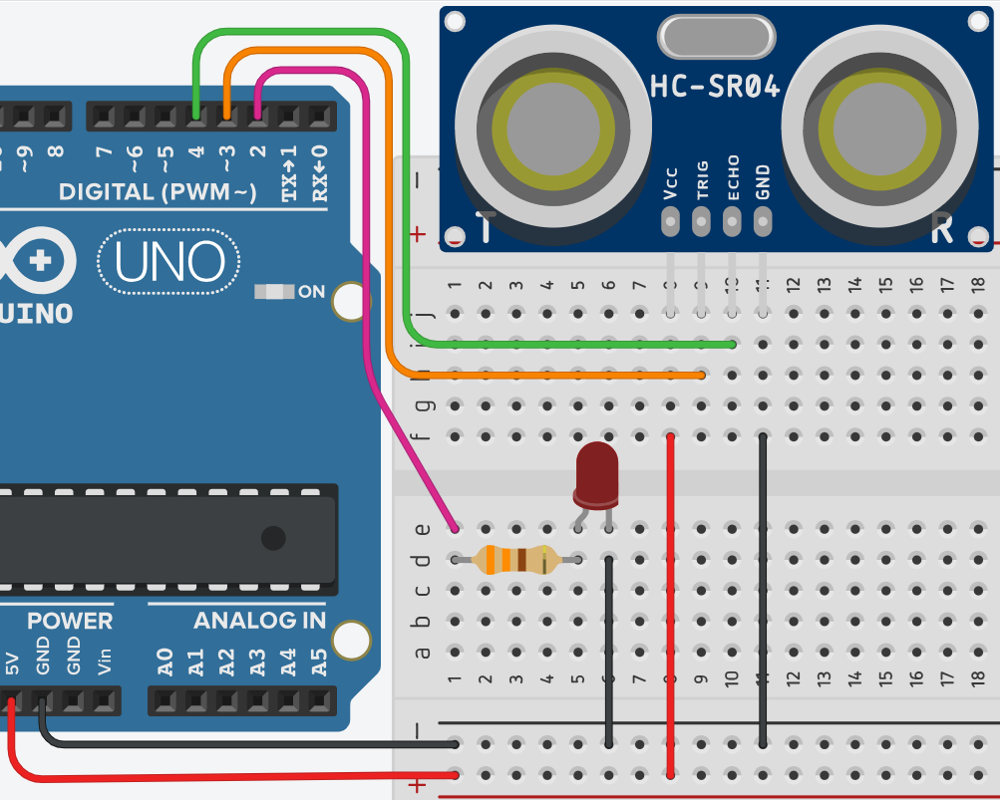

# **Alerta con Sensor de distancia**



## **Explicación del código**

Este programa combina un sensor ultrasónico HC-SR04 con un LED para crear un sistema de alerta de proximidad. Cuando un objeto se encuentra a 150 cm o menos del sensor, el LED se enciende, indicando que algo está dentro del rango de alerta.

### **1. Declaración de variables globales**

```cpp
const int led = 2, echo = 4, trig = 3;
int time = 0;
float distancia = 0;
```

- `const int led = 2;`: Define el pin 2 para el LED de alerta.
- `const int echo = 4;` y `trig = 3;`: Pines para el sensor ultrasónico. `trig` dispara el pulso, `echo` recibe el eco.
- `int time = 0;`: Almacena la duración del pulso de eco en microsegundos.
- `float distancia = 0;`: Almacena la distancia calculada en centímetros.

### **2. Configuración `setup()`**

```cpp
void setup()
{
  Serial.begin(9600);
  pinMode(led, OUTPUT);
  pinMode(echo, INPUT);
  pinMode(trig, OUTPUT);
}
```

- `Serial.begin(9600);`: Inicializa la comunicación serie para depuración.
- `pinMode(led, OUTPUT);`: Configura el pin del LED como salida.
- `pinMode(echo, INPUT);` y `pinMode(trig, OUTPUT);`: Configuran los pines del sensor ultrasónico.

### **3. Bucle `loop()`**

```cpp
void loop()
{
  digitalWrite(trig, HIGH);
  delay(1);
  digitalWrite(trig, LOW);

  time = pulseIn(echo, HIGH);
  distancia = time / 58.2;

  if (distancia <= 150)
    digitalWrite(led, HIGH);
  else
    digitalWrite(led, LOW);
}
```

- El bloque de disparo y medición funciona igual que en el ejercicio del sensor de distancia: se envía un pulso de 1 ms por `trig` y se mide el tiempo de retorno con `pulseIn()`.
- `distancia = time / 58.2;`: Convierte el tiempo en distancia (cm).
- `if (distancia <= 150)`: Evalúa si la distancia medida es menor o igual a 150 cm.
  - Si es `true`, enciende el LED (`digitalWrite(led, HIGH)`).
  - Si es `false`, apaga el LED (`digitalWrite(led, LOW)`).
- **Nota:** Este programa no muestra valores en el Monitor Serie a menos que se agregue explícitamente, pero `Serial.begin()` está presente por si se desea agregar depuración.

### **Código completo para copiar y pegar**

```cpp
// Alerta con Sensor de distancia ultrasónico

const int led = 2, echo = 4, trig = 3;
int time = 0;
float distancia = 0;

void setup()
{
  Serial.begin(9600);
  pinMode(led, OUTPUT);
  pinMode(echo, INPUT);
  pinMode(trig, OUTPUT);
}

void loop()
{
  digitalWrite(trig, HIGH);
  delay(1);
  digitalWrite(trig, LOW);

  time = pulseIn(echo, HIGH);
  distancia = time / 58.2;

  if (distancia <= 150)
    digitalWrite(led, HIGH);
  else
    digitalWrite(led, LOW);
}
```

### **Enlace al simulador**

[Código en Tinkercad](https://www.tinkercad.com/things/kdX2Tsg0tZ4-practica-07-p4-alerta-con-sensor-de-distancia)

---

## **Preguntas teóricas**

1. ¿Por qué se usa `const int` para los pines y `float` para la distancia? ¿Qué pasaría si `distancia` fuera de tipo `int`?
2. En la condición `if (distancia <= 150)`, ¿qué tipo de dato tiene el valor 150? ¿Cómo maneja C++ la comparación entre `float` y `int`?
3. ¿Qué ventaja tiene usar `else` en lugar de escribir una segunda condición `if (distancia > 150)`?
4. ¿Por qué se incluye `Serial.begin(9600)` si no se usa `Serial.print()` en el código? ¿En qué situación sería útil?
5. ¿Qué sucede si el sensor ultrasónico no recibe un eco (por ejemplo, si el objeto está fuera del rango máximo)? ¿Qué valor devuelve `pulseIn()` y cómo afecta al LED?

---

## **Ejercicios prácticos (modificar el código y anotar cambios)**

**Instrucciones:** Copia el código original, realiza la modificación indicada, carga el programa en el simulador (o en Arduino real) y describe cómo cambia el comportamiento del circuito.

### **Ejercicio 1**
Cambia la distancia de activación a 50 cm en lugar de 150 cm.
*Pregunta:* ¿El LED se enciende solo cuando el objeto está más cerca? ¿Qué aplicación práctica tendría este cambio?

### **Ejercicio 2**
Modifica la lógica para que el LED se encienda **solo cuando la distancia esté entre 30 cm y 100 cm** (zona de alerta media). Fuera de ese rango, el LED debe permanecer apagado.
*Pregunta:* ¿Cómo se escribe una condición compuesta con `&&`? ¿El LED se comporta como se espera?

### **Ejercicio 3**
Agrega un segundo LED en el pin 13 que se encienda cuando la distancia sea menor a 30 cm (alerta cercana). Debes tener entonces dos LEDs con diferente umbral de activación.
*Pregunta:* ¿Cómo se organizan las condiciones para tener dos niveles de alerta? Describe el comportamiento en cada zona de distancia.

### **Ejercicio 4**
Agrega un zumbador (buzzer) en el pin 5 que emita un tono cuando el LED esté encendido (distancia ≤ 150 cm). Usa `tone(5, 1000)` para encenderlo y `noTone(5)` para apagarlo.
*Pregunta:* ¿El sonido añade una dimensión útil a la alerta? ¿En qué aplicaciones sería importante tener alerta sonora?

### **Ejercicio 5**
Muestra la distancia en el Monitor Serie (como en P3) junto con el estado del LED ("LED: ON" u "LED: OFF") para propósitos de depuración.
*Pregunta:* ¿La información del Monitor Serie ayuda a verificar el correcto funcionamiento del sistema? ¿Qué valores esperas ver cuando el LED cambia de estado?

---

*Entregar las respuestas a las preguntas teóricas y la descripción de los cambios observados en cada ejercicio.*
