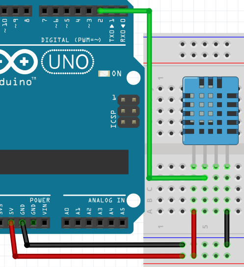

# **Sensor de temperatura y humedad (DHT11 y DHT22)**



El DHT11 y el DHT22 son sensores de temperatura y humedad ampliamente utilizados en proyectos de electrónica y domótica. Aunque ambos sensores tienen funciones similares y la misma interfaz de comunicación (un solo cable de datos), existen diferencias clave entre ellos en cuanto a precisión, rango de medición y velocidad de muestreo.

### **Características del DHT11**
- Rango de Temperatura: 0 a 50 °C
- Precisión de Temperatura: ±2 °C
- Rango de Humedad: 20-90% RH
- Precisión de Humedad: ±5% RH
- Frecuencia de Muestreo: 1 Hz (1 muestra por segundo)

### **Características del DHT22**
- Rango de Temperatura: -40 a 80 °C
- Precisión de Temperatura: ±0.5 °C
- Rango de Humedad: 0-100% RH
- Precisión de Humedad: ±2-5% RH
- Frecuencia de Muestreo: 0.5 Hz (1 muestra cada 2 segundos)

## **Explicación del código**

Este programa utiliza la biblioteca DHT de Adafruit para leer temperatura y humedad desde un sensor DHT11 o DHT22, y muestra los valores incluyendo el índice de calor (heat index) en el Monitor Serie.

### **1. Inclusión de librería y definiciones**

```cpp
#include "DHT.h"

#define DHTPIN 2
//#define DHTTYPE DHT11
#define DHTTYPE DHT22

DHT dht(DHTPIN, DHTTYPE);
```

- `#include "DHT.h"`: Incluye la biblioteca DHT de Adafruit.
- `#define DHTPIN 2`: Define el pin de datos del sensor.
- `#define DHTTYPE DHT22`: Define el tipo de sensor. Se debe comentar/descomentar la línea correspondiente según el sensor usado.
- `DHT dht(DHTPIN, DHTTYPE)`: Crea un objeto `dht` que manejará la comunicación con el sensor.

### **2. Configuración `setup()`**

```cpp
void setup() {
  Serial.begin(9600);
  Serial.println("DHTxx test!");
  dht.begin();
}
```

- Inicializa la comunicación serie a 9600 baudios.
- `dht.begin()`: Inicializa el sensor DHT. Este método configura el pin y prepara el protocolo de comunicación.

### **3. Bucle `loop()`**

```cpp
void loop() {
  delay(2000);

  float h = dht.readHumidity();
  float t = dht.readTemperature();
  float f = dht.readTemperature(true);

  if (isnan(h) || isnan(t) || isnan(f)) {
    Serial.println("Falla al leer el sensor de calor!");
    return;
  }

  float hif = dht.computeHeatIndex(f, h);
  float hic = dht.computeHeatIndex(t, h, false);

  Serial.print("Humedad: ");
  Serial.print(h);
  Serial.print(" %\t");
  Serial.print("Temperatura: ");
  Serial.print(t);
  Serial.print(" *C ");
  Serial.print(f);
  Serial.print(" *F\t");
  Serial.print("Índice de calor: ");
  Serial.print(hic);
  Serial.print(" *C ");
  Serial.print(hif);
  Serial.println(" *F");
}
```

- `delay(2000)`: Espera 2 segundos entre lecturas (mínimo recomendado para DHT22).
- `dht.readHumidity()`: Lee la humedad relativa en porcentaje.
- `dht.readTemperature()`: Lee la temperatura en grados Celsius.
- `dht.readTemperature(true)`: Lee la temperatura en grados Fahrenheit.
- `isnan()`: Verifica si alguna lectura falló (retorna `NaN`). Si hay fallo, muestra un mensaje y reinicia el `loop()`.
- `dht.computeHeatIndex(f, h)`: Calcula el índice de calor en Fahrenheit usando temperatura y humedad.
- `dht.computeHeatIndex(t, h, false)`: Calcula el índice de calor en Celsius.
- Los resultados se muestran en el Monitor Serie con formato tabulado.

### **Código completo para copiar y pegar**

```cpp
// Sensor de temperatura y humedad (DHT11 y DHT22)

#include "DHT.h"

#define DHTPIN 2
//#define DHTTYPE DHT11
#define DHTTYPE DHT22

DHT dht(DHTPIN, DHTTYPE);

void setup() {
  Serial.begin(9600);
  Serial.println("DHTxx test!");
  dht.begin();
}

void loop() {
  delay(2000);

  float h = dht.readHumidity();
  float t = dht.readTemperature();
  float f = dht.readTemperature(true);

  if (isnan(h) || isnan(t) || isnan(f)) {
    Serial.println("Falla al leer el sensor de calor!");
    return;
  }

  float hif = dht.computeHeatIndex(f, h);
  float hic = dht.computeHeatIndex(t, h, false);

  Serial.print("Humedad: ");
  Serial.print(h);
  Serial.print(" %\t");
  Serial.print("Temperatura: ");
  Serial.print(t);
  Serial.print(" *C ");
  Serial.print(f);
  Serial.print(" *F\t");
  Serial.print("Índice de calor: ");
  Serial.print(hic);
  Serial.print(" *C ");
  Serial.print(hif);
  Serial.println(" *F");
}
```

### **Enlace al simulador**

[Código en Tinkercad](https://www.tinkercad.com/things/254aJdmC3zK-practica-08-p1-sensor-de-temperatura-y-humedad-dht11-y-22)

---

## **Preguntas teóricas**

1. ¿Cuáles son las diferencias principales entre el DHT11 y el DHT22 en cuanto a precisión y rango?
2. ¿Por qué es necesario un delay de al menos 2 segundos entre lecturas? ¿Qué pasa si se lee más rápido?
3. ¿Qué significa `isnan()` y por qué se usa para verificar las lecturas del sensor?
4. ¿Qué es el índice de calor (heat index) y cómo se calcula? ¿Por qué es útil?
5. ¿Qué función cumple `dht.begin()`? ¿Qué sucede si se omite esta línea?

---

## **Ejercicios prácticos (modificar el código y anotar cambios)**

**Instrucciones:** Copia el código original, realiza la modificación indicada, carga el programa en el simulador (o en Arduino real) y describe cómo cambia el comportamiento del circuito.

### **Ejercicio 1**
Cambia el tipo de sensor a DHT11 (descomenta la línea correspondiente y comenta la del DHT22).
*Pregunta:* ¿Los valores cambian? ¿El comportamiento del programa es el mismo?

### **Ejercicio 2**
Reduce el delay entre lecturas a 500 ms y observa qué sucede.
*Pregunta:* ¿El sensor sigue funcionando correctamente? ¿Aparecen errores de lectura? ¿Por qué?

### **Ejercicio 3**
Agrega un LED en el pin 13 que se encienda cuando la temperatura supere los 30 °C.
*Pregunta:* ¿Cómo integras la condición en el código? ¿El LED responde correctamente?

### **Ejercicio 4**
Muestra los valores de temperatura y humedad en una pantalla LCD 16×2 en lugar del Monitor Serie.
*Pregunta:* ¿Qué librería adicional necesitas? ¿Cómo distribuyes los datos en las dos filas?

### **Ejercicio 5**
Agrega detección de tendencia: muestra si la temperatura está subiendo, bajando o estable comparando con la lectura anterior.
*Pregunta:* ¿Cómo almacenas la lectura anterior? ¿Qué margen definiste para considerar "estable"?

---

*Entregar las respuestas a las preguntas teóricas y la descripción de los cambios observados en cada ejercicio.*
