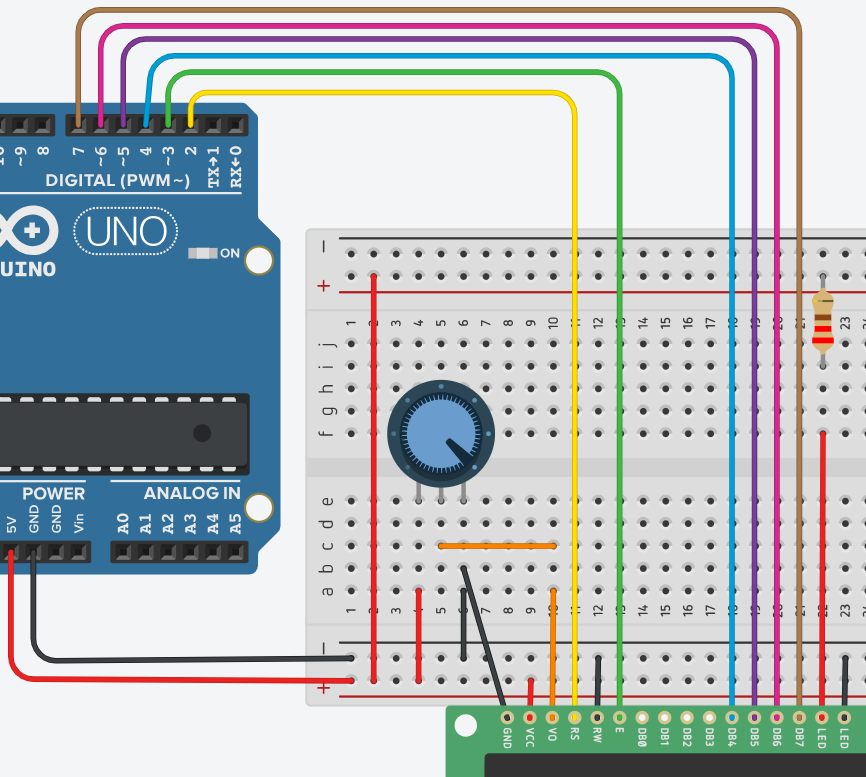
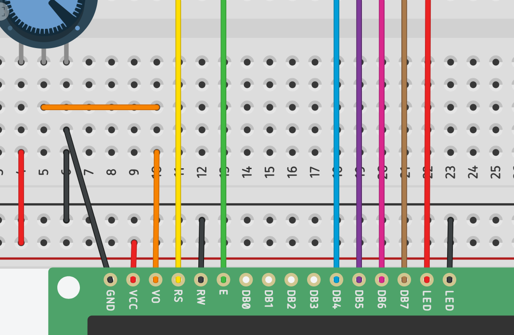

# **Pantalla LCD 16x2**




## **Explicación del código**

Este programa muestra una cuenta regresiva del 9 al 1 en una pantalla LCD 16×2 utilizando la librería `LiquidCrystal`. El mensaje "cuenta regresiva" se muestra en la primera fila y el número en la segunda.

### **1. Declaración de pines y creación del objeto LCD**

```cpp
#include <LiquidCrystal.h>

const int RS = 2, E = 3, D4 = 4, D5 = 5, D6 = 6, D7 = 7;
int num = 9;

LiquidCrystal lcd(RS, E, D4, D5, D6, D7);
```

- `#include <LiquidCrystal.h>`: Incluye la librería estándar para controlar pantallas LCD compatibles con el controlador Hitachi HD44780.
- `RS = 2, E = 3, D4 = 4, ..., D7 = 7`: Pines de datos de la pantalla en modo 4 bits (usa 6 pinos: RS, Enable, y 4 líneas de datos).
- `int num = 9;`: Variable para el contador regresivo.
- `LiquidCrystal lcd(RS, E, D4, D5, D6, D7)`: Crea un objeto `lcd` asociado a los pines especificados.

### **2. Configuración `setup()`**

```cpp
void setup() {
  lcd.begin(16, 2);
}
```

- `lcd.begin(16, 2)`: Inicializa la pantalla indicando que tiene 16 columnas y 2 filas. Este método configura la comunicación y prepara la pantalla para recibir datos.

### **3. Bucle `loop()`**

```cpp
void loop() {
  lcd.setCursor(0, 0);
  lcd.print("cuenta regresiva");

  lcd.setCursor(0, 1);
  lcd.print(num);

  num--;

  delay(1000);

  if (num < 1) {
    num = 9;
  }

  lcd.clear();
}
```

- `lcd.setCursor(columna, fila)`: Posiciona el cursor en la pantalla. La primera fila es 0, la segunda es 1.
- `lcd.print("cuenta regresiva")`: Muestra el texto en la posición actual del cursor.
- `lcd.setCursor(0, 1)`: Mueve el cursor al inicio de la segunda fila.
- `lcd.print(num)`: Muestra el número actual del contador.
- `num--`: Decrementa el contador en 1 cada iteración.
- `delay(1000)`: Espera 1 segundo entre cada número.
- `if (num < 1) num = 9`: Cuando el contador llega a 0, se reinicia a 9.
- `lcd.clear()`: Limpia toda la pantalla. Esto es necesario para borrar el número anterior antes de mostrar el nuevo.

### **Código completo para copiar y pegar**

```cpp
// Pantalla LCD 16x2 - Cuenta regresiva

#include <LiquidCrystal.h>

const int RS = 2, E = 3, D4 = 4, D5 = 5, D6 = 6, D7 = 7;
int num = 9;

LiquidCrystal lcd(RS, E, D4, D5, D6, D7);

void setup() {
  lcd.begin(16, 2);
}

void loop() {
  lcd.setCursor(0, 0);
  lcd.print("cuenta regresiva");

  lcd.setCursor(0, 1);
  lcd.print(num);

  num--;

  delay(1000);

  if (num < 1) {
    num = 9;
  }

  lcd.clear();
}
```

### **Enlace al simulador**

[Código en Tinkercad](https://www.tinkercad.com/things/7B6L6WMmvzu-practica-08-p2-pantalla-lcd-16x2)

---

## **Preguntas teóricas**

1. ¿Qué significan RS y E en el contexto de una pantalla LCD? ¿Cuál es la función de cada uno?
2. ¿Qué diferencia hay entre usar el modo de 4 bits y el modo de 8 bits para comunicarse con la LCD?
3. ¿Por qué se usa `lcd.clear()` al final del `loop()`? ¿Qué pasaría si se omite?
4. ¿Cómo funciona `lcd.setCursor(col, row)`? ¿Cuáles son los valores válidos para una pantalla 16×2?
5. ¿Qué sucede si se escribe un texto de más de 16 caracteres en una sola fila?

---

## **Ejercicios prácticos (modificar el código y anotar cambios)**

**Instrucciones:** Copia el código original, realiza la modificación indicada, carga el programa en el simulador (o en Arduino real) y describe cómo cambia el comportamiento del circuito.

### **Ejercicio 1**
Cambia la cuenta regresiva para que vaya de 99 a 0 (números de 2 dígitos). Ajusta la posición del cursor para centrar los números.
*Pregunta:* ¿Qué cambios hiciste en el código? ¿El número de 2 dígitos se muestra correctamente?

### **Ejercicio 2**
Haz una cuenta progresiva de 0 a 9 en lugar de regresiva.
*Pregunta:* ¿Cómo modificaste la lógica del contador? ¿Usaste `num++` en lugar de `num--`?

### **Ejercicio 3**
Muestra la temperatura de un sensor LM35 en la primera fila y la humedad de un sensor DHT11 en la segunda fila.
*Pregunta:* ¿Cómo integras la lectura de sensores? ¿Usaste `lcd.setCursor()` para ubicar cada valor?

### **Ejercicio 4**
Elimina `lcd.clear()` y en su lugar escribe espacios en blanco sobre el número anterior antes de mostrar el nuevo.
*Pregunta:* ¿Notas parpadeo? ¿Cuál método es mejor: `lcd.clear()` o escribir espacios?

### **Ejercicio 5**
Crea un menú simple de 2 opciones usando un botón en el pin 8 para cambiar entre "Mostrar contador" y "Mostrar temperatura simulada". Usa `lcd.clear()` entre cambios.
*Pregunta:* ¿Cómo implementaste el cambio de pantalla? ¿Usaste una variable `menu` y `if-else`?

---

*Entregar las respuestas a las preguntas teóricas y la descripción de los cambios observados en cada ejercicio.*
